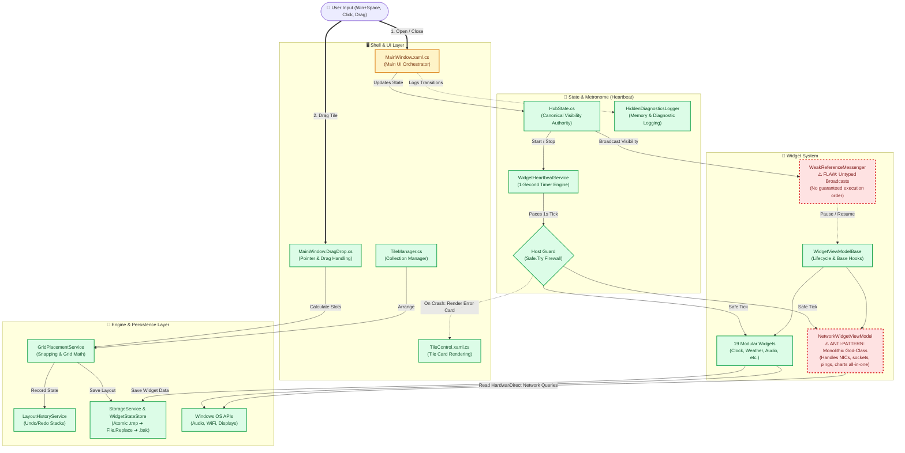

# MetroHub: Architecture Flow & Flaws Map

> **Purpose:** Visual reference for developers documenting how MetroHub connects end-to-end, how data and events flow, and where remaining architectural flaws/anti-patterns exist.

---

## 1. System Wiring & Flaw Diagram

---

## 2. Color Legend & Architectural Health

| Color | Status | Meaning |
|---|---|---|
| 🟩 **Green** | **Healthy / Decoupled** | Follows single-responsibility, is guarded against failure, and has deterministic flow. |
| 🟨 **Amber** | **Cohesive but Dense** | Works reliably, but has high coordination responsibility. Treat with care. |
| 🟥 **Red** | **Anti-Pattern / Flaw** | Technical debt or structural anti-pattern that should be monitored or refactored in the future. |

---

## 3. Deep Dive into the 3 Red Flaws & Anti-Patterns

### 🟥 Flaw 1: `NetworkWidgetViewModel` (Monolithic God-Class)
- **Location:** `src/MetroHub/Widgets/Catalog/Network/NetworkWidgetViewModel.cs`
- **The Problem:** 
  The network widget is over 1,000 lines long and handles 5 disparate domains simultaneously:
  1. Windows Network Interface (NIC) discovery and IP status polling.
  2. Byte-rate differential throughput arithmetic.
  3. Continuous internet latency ICMP ping socket requests.
  4. Real-time ring-buffer chart history rendering.
  5. UI property transformation and formatting.
- **Why It Remains:** 
  It is proven and working in production. Per owner directive, it was intentionally left untouched during Phase 3/4 to protect user stability.
- **Future Solution:** 
  Split into a pure domain worker (`NetworkMonitorService`), a chart model helper, and a lightweight ViewModel containing only UI bindings.

---

### 🟥 Flaw 2: `WeakReferenceMessenger` (Implicit Broadcasts)
- **Location:** `CommunityToolkit.Mvvm.Messaging.WeakReferenceMessenger`
- **The Problem:** 
  When `HubState` changes visibility, the messenger broadcasts `HubVisibilityChangedMessage` to all subscribers simultaneously. 
  Because it is an untyped publish/subscribe bus:
  - There is **no guaranteed execution order** between widgets.
  - If Widget A depends on Widget B waking up first, subtle timing or race bugs can happen.
  - Code search cannot easily show who responds to what message without manual grepping.
- **Current Mitigation:** 
  `WidgetHeartbeatService` and `HubState` keep timers decoupled from the message payload.
- **Future Solution:** 
  Keep `WeakReferenceMessenger` strictly for cross-boundary UI events, and use direct lifecycle callbacks for core services.

---

### 🟩 Flaw 3 (Resolved): `TEMP-SHIM(T-22)` Legacy Forwarder Removed
- **Status:** **REMOVED**
- `HiddenDiagnosticsLogger.IsHubHidden` was verified to have 0 callers across the solution and has been deleted. `HiddenDiagnosticsLogger` is now 100% state-free.

---

## 4. The Amber Component: `MainWindow.xaml.cs`
- **Location:** `src/MetroHub/MainWindow*.cs`
- **Description:** 
  `MainWindow` is partitioned into partial classes (`.DragDrop.cs`, `.Tiles.cs`), which makes file sizes manageable. However, it still acts as an **orchestrator** that directly manages:
  - Win32 keyboard/mouse hooks and OS window messages (`WndProc`).
  - Tile drag-and-drop gesture states.
  - Backdrop window composition (Mica, Acrylic, Desktop Wallpaper).
- **Guidance:** 
  Do not add business logic to `MainWindow`. Route state changes through `HubState` and math through `GridPlacementService`.

---

## 5. The Green Core: Why the Rest is Solid

1. **`HubState.cs`:**
   Canonical, thread-safe authority on visibility (`IsVisible`, `IsHidden`, `VisibilityChanged`).
2. **`WidgetHeartbeatService` + Host Guard:**
   Paces a 1-second pulse to visible widgets. If any widget throws an exception during its tick, the guard catches it, logs it, renders a red error card on that tile, and keeps the other 19 widgets alive.
3. **`StorageService` & `WidgetStateStore`:**
   Atomic save pattern (`.tmp` $\rightarrow$ `File.Replace` $\rightarrow$ `.bak`) wrapped in `Safe.Try`. Guaranteed zero silent data loss.
4. **`GridPlacementService`:**
   Pure, deterministic 2D grid placement math completely decoupled from WPF controls.
