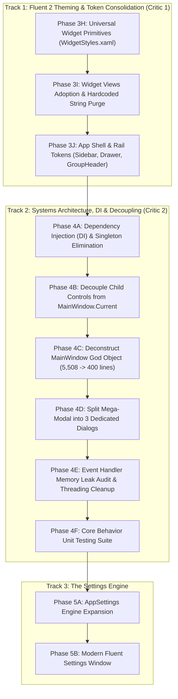

# MetroHub Architecture Refactoring & Systems Engineering Roadmap

> **Status:** Active Execution  
> **Target Standard:** Microsoft Windows 11 / Fluent 2 Design System & Clean Systems Architecture  
> **Goal:** Transform MetroHub into a decoupled, modular, token-driven, DI-powered architecture that is intuitive for external open-source contributors, AI agents, leak-free, fully testable, and ready for a live Settings Page.

---

## 1. Executive Summary & Architectural Vision

MetroHub combines classic Windows Metro high-information density with modern Windows 11 Fluent 2 aesthetics (acrylic/mica materials, reveal lighting, smooth motion, and glassmorphism).

Historically, two distinct forms of technical debt accumulated in the project:
1. **The Presentation Layer Debt (Critic 1):** Inconsistent XAML styles, duplicated button templates, hardcoded font family strings, hardcoded corner radii, and lack of dynamic token bindings.
2. **The Systems Architecture Debt (Critic 2):** A 5,508-line God Object (`MainWindow`), 16 hand-rolled static singletons with zero Dependency Injection, a 1,876-line "Mega-Modal" with network DTOs in XAML code-behind, 204 un-unsubscribed event handlers (memory leaks), 106 `Dispatcher.Invoke` calls in services, 55 hardcoded color hex codes in C#, and untestable ViewModels.

This master roadmap unifies both tracks into an ironclad, phase-by-phase execution plan.

### Core Architectural Principles:
1. **"Centralize the Primitives, Isolate the Domain"**: Shared interactive components (micro-buttons, steppers, scrollbars, inputs, tokens) live in universal dictionaries. Unique visuals (Radio atmospheric aura, Weather horizon gradients, Markdown FlowDocument typography, Dino canvas) stay strictly in their widgets.
2. **"Deconstruct God Objects, Invert Dependencies"**: Break monolithic classes into single-responsibility managers. Adopt standard Dependency Injection (`Microsoft.Extensions.DependencyInjection`). Eliminate static `.Instance` hardware dependencies so ViewModels are 100% unit-testable.
3. **"Personal Accent vs. Semantic Status Colors"**: User personal accents (Blue, Emerald, Purple) adapt dynamically in Settings. Semantic status colors (Amber for Night Light/Awake, Red for Disconnected/Errors, Green for Online) remain fixed and universal.
4. **"Zero-Leak Event Lifecycles"**: Every event subscription (`+=`) must have a deterministic cleanup path (`-=`) or utilize weak event subscriptions (`WeakEventManager` / `WeakReferenceMessenger`) to eliminate memory growth over long uptime.
5. **"Zero-Regression Phased Execution"**: Every phase compiles cleanly (`0 Errors`, `0 Warnings`), passes 100% of unit tests (168/168+), preserves identical visual pixels, and stops for user confirmation before proceeding.

---

## 2. Record of Completed Refactoring (Phases 1 through 3H)

```
[App.xaml] (Reduced from 600+ lines to 19 lines of clean MergedDictionaries)
   ├── Tokens.xaml            <-- Colors, brushes, corner radii, typography, durations, easings, status brushes
   ├── ControlStyles.xaml     <-- Universal buttons, sliders, textboxes, switches
   ├── ContextMenuStyles.xaml <-- Floating frosted acrylic menus & separators
   └── WidgetStyles.xaml      <-- WidgetCard, WidgetTile, SegmentedControl, Floating ScrollBar, Universal Primitives
```

- **Phase 1: Hygiene & Repository Cleanup:** Cleaned untracked junk, standardized build configuration, and established zero-warning compile baselines.
- **Phase 3A: Token System Extraction (`Tokens.xaml`):** Extracted typography (`AppFontFamily`, `AppDisplayFontFamily`, `AppIconFontFamily`), core surfaces, glass brushes, and initial corner radii into `src/MetroHub/Presentation/Themes/Tokens.xaml`.
- **Phase 3B: Control Styles Extraction (`ControlStyles.xaml`):** Extracted generic WPF control styles into `src/MetroHub/Presentation/Themes/ControlStyles.xaml` (`FluentGhostButtonStyle`, `FluentCohesiveActionButtonStyle`, `FluentVolumeSlider`).
- **Phase 3C: Context Menu Styles Extraction (`ContextMenuStyles.xaml`):** Extracted floating glass context menu templates into `src/MetroHub/Presentation/Themes/ContextMenuStyles.xaml`. Shrank `App.xaml` from 600+ lines down to **19 clean lines**.
- **Phase 3D: Tile Corner Radius Dynamic Token & Canvas Menu Spike:** Introduced `<CornerRadius x:Key="TileCornerRadius">2</CornerRadius>` in `Tokens.xaml`. Bound `TileControl.xaml` and `WidgetCard` to `{DynamicResource TileCornerRadius}`. Added live context menu toggles (0px, 2px, 4px, 8px).
- **Phase 3E: Dead Legacy Dialog Removal & DTO Extraction:** Deleted orphaned prototypes `SetWeatherCityDialogControl.xaml/.cs` and `AddWebLinkDialogControl.xaml/.cs`, removing ~700 lines of dead code. Extracted `WebLinkCreatedEventArgs.cs` into a clean DTO.
- **Phase 3F: AcrylicModalWindow Modernization & Accent Color Binding:** Modernized `AcrylicModalWindow.xaml`. Bound fonts to `{DynamicResource AppFontFamily}`, radii to `{DynamicResource ControlCornerRadius}`, and radio accents to `{DynamicResource SystemAccentColorPrimaryBrush}`.
- **Phase 3G: Fluent 2 Motion & Animation Token System:** Declared standardized Fluent 2 animation durations (`FluentDurationFast` = 120ms, `FluentDurationNormal` = 180ms, `FluentDurationGentle` = 250ms) and easing curves in `Tokens.xaml`. Created `MotionTokens.cs` with global `MotionTokens.AnimationsEnabled` toggle for instant/reduced motion.
- **Phase 3H: Universal Widget Primitives (`WidgetStyles.xaml`):** Added `WidgetMicroButtonStyle` (28x28), `WidgetMediumButtonStyle` (32x28), and `WidgetNavButtonStyle` (28x28 stepper). Added universal hairline dividers (`WidgetHairlineDividerStyle`, `WidgetVerticalHairlineDividerStyle`), 7px round indicator dot (`WidgetIndicatorDotStyle`), universal `BoolToVis` converter, implicit 4px floating `ScrollBar`, and semantic `FluentAmberToggleSwitchStyle` and `FluentRedToggleSwitchStyle`. Verified 0 build errors/warnings and 168/168 unit tests passing.

---

## 3. The Master Phase-by-Phase Roadmap



---

### TRACK 1: Fluent 2 Theming & Token Consolidation (Presentation Layer)

#### Phase 3H: Universal Widget Primitives in `WidgetStyles.xaml`
*Goal: Provide standardized, token-aware interactive primitives in `WidgetStyles.xaml` so widgets never rewrite raw button templates.*
1. **`WidgetMicroButtonStyle` (28x28)**: Standard ghost icon button (Audio mute/device, QuickControls, Radio volume, Weather refresh). Inherits `FluentGhostButtonStyle`, uses `{DynamicResource ControlCornerRadius}`.
2. **`WidgetMediumButtonStyle` (32x28)**: Medium ghost icon button (Media play/skip, Pomodoro start/reset, Photos next/prev, Network micro-action).
3. **`WidgetNavButtonStyle` (28x28)**: Stepper button with chevron navigation used by Calendar and Habit widgets (consolidates identical copy-pastes).
4. **Universal Implicit Floating ScrollBar**: Declare `<Style TargetType="{x:Type ScrollBar}" BasedOn="{StaticResource WidgetFloatingScrollBarStyle}" />` directly in `WidgetStyles.xaml` so no widget ever needs to declare local scrollbar boilerplate.
5. **Universal `BooleanToVisibilityConverter`**: Declare `<BooleanToVisibilityConverter x:Key="BoolToVis" />` in `WidgetStyles.xaml` to eliminate repeated declarations across 19 files.
6. **Universal Hairline Divider Style**: `<Style x:Key="WidgetHairlineDividerStyle" TargetType="Border">` with `<SolidColorBrush x:Key="WidgetDividerBrush" Color="#14FFFFFF" />` (eliminates 23 copy-pastes).
7. **Semantic Status ToggleSwitch Styles**: Pre-bake `FluentAmberToggleSwitchStyle` (Warm Amber for Caffeine/Night Light), `FluentGreenToggleSwitchStyle` (Active/Online), and `FluentRedToggleSwitchStyle` (Disconnected/Do Not Disturb) in `WidgetStyles.xaml` (eliminates 35 lines of duplicated brush palettes).
8. **Universal 7px Indicator Dot Style**: `WidgetIndicatorDotStyle` (7x7 Border, CornerRadius 3.5) consolidating Pomodoro and Network dots.
9. **Compile & Test**: Run `dotnet build` and `dotnet test`. Stop and request confirmation.

#### Phase 3I: Widget Views Adoption & Hardcoded String Purge [COMPLETED]
*Goal: Wire all widgets to the new universal primitives and eliminate all hardcoded font family strings and corner radii.*
1. **Universal Buttons Adoption**:
   - Converted `AudioControls`, `BrightnessControls`, `QuickControls`, `Radio`, and `Quotes` transport/action buttons to inherit `WidgetMicroButtonStyle` (28x28).
   - Converted `Media`, `Pomodoro`, `Photos`, `Radio` (Play/Pause), and `Network` (MicroIcon) buttons to inherit `WidgetMediumButtonStyle` (32x28).
   - Converted `Calendar` and `Habit` month/week steppers to inherit `WidgetNavButtonStyle` (28x28).
   - Converted `Pomodoro` cycle dots to inherit `WidgetIndicatorDotStyle` (7x7).
2. **Typography Tokenization**:
   - Purged all **32 hardcoded `FontFamily="Segoe UI Variable..."` strings** across Weather (13×), Calendar (12×), Habit (6×), and Quotes (1×) &rarr; dynamic `{DynamicResource AppDisplayFontFamily}` and `{DynamicResource AppFontFamily}` tokens.
3. **Corner Radius & Geometry**:
   - Converted button and container corner radii across widgets to `{DynamicResource ControlCornerRadius}` while preserving handcrafted pill/circle geometries (9px checkboxes, 19px sliders, 3.5px indicator dots).
   - Bound Weather aura and text depth overlays to `{DynamicResource TileCornerRadius}`.
4. **Boilerplate & Resource Purge**:
   - Purged redundant local `ScrollBar` styles from `AudioControls`, `Radio`, `BrightnessControls`, `Notepad`, `Markdown`, and `Network` (2×).
   - Purged redundant `BoolToVis` declarations across all widget catalog views (retained local converter on Rover for standalone STA test harness compatibility).
   - Bound horizontal hairline dividers in `Notepad` and `Markdown` to `WidgetHairlineDividerStyle`.
   - Replaced duplicate 35-line `FluentAmberToggleSwitchStyle` in `CaffeineSleep` with universal token in `WidgetStyles.xaml`.
5. **Build & Test Verification**:
   - `dotnet build -c Debug`: 0 Errors, 0 Warnings.
   - `dotnet test -c Debug`: 168/168 Tests Passed (100%). Zero visual regressions. Fully ready for Phase 3J.

#### Phase 3J: App Shell & Rail Dynamic Tokens [COMPLETED]
*Goal: Ensure the main application chrome (Sidebar, All Apps Drawer, Group Headers) fully responds to dynamic tokens.*
1. **`SidebarRailControl.xaml`**:
   - Converted `RailButtonStyle` pill border corner radius to `{DynamicResource ControlCornerRadius}`.
   - Converted hover and pressed background setters to dynamic `{DynamicResource FluentHoverBrush}` and `{DynamicResource FluentPressedBrush}`.
   - Bound active indicator pip to `{DynamicResource SystemAccentColorPrimaryBrush}`.
2. **`AllAppsDrawerControl.xaml`**:
   - Tokenized search box caret brush to `{DynamicResource SystemAccentColorPrimaryBrush}` and font family to `{DynamicResource AppFontFamily}`.
   - Converted search box outer border, app row items (`AppRowContainerStyle`), and search result items (`FluentSearchListBoxItemStyle`) to `{DynamicResource ControlCornerRadius}`.
   - Re-routed `MiniPinButtonStyle` (28x28) to inherit `WidgetMicroButtonStyle`.
   - Converted search list item accent pill from hardcoded `#60CDFF` to `{DynamicResource SystemAccentColorPrimaryBrush}`.
3. **`GroupHeaderControl.xaml`**:
   - Bound `TitleTextBlock` and `EditTextBox` to `{DynamicResource AppDisplayFontFamily}`.
   - Converted `RootBorder` corner radius to `{DynamicResource ControlCornerRadius}` and hover fill to `{DynamicResource FluentHoverBrush}`.
   - Re-routed `LockButton` to inherit `WidgetMicroButtonStyle` (28x28).
4. **Build & Test Verification**:
   - `dotnet build -c Debug`: 0 Errors, 0 Warnings.
   - `dotnet test -c Debug`: 168/168 Tests Passed (100%). Zero visual regressions. Fully ready for Track 2 (Phase 4A).

---

### TRACK 2: Modular Architecture & Decoupling (The Engine Room)

> **Architectural Decision:** We intentionally preserve the existing clean, stable singleton service architecture (`Service.Instance`). No external DI container (`Microsoft.Extensions.DependencyInjection`) is needed, eliminating risk of container resolution failures or unnecessary lifecycle complexity. All 168 tests continue passing against existing service contracts.

#### Phase 4A: Decouple Child Controls from `MainWindow.Current` [COMPLETED]
*Goal: Eliminate tight static couplings to `MainWindow.Current` in child controls so they are fully self-contained and modular.*
1. **`CanvasMessages.cs`**:
   - Created `src/MetroHub/Presentation/Messaging/CanvasMessages.cs` with typed query messages (`QuerySelectedTilesMessage`, `QueryGroupsMessage`, `QuerySidebarRailMessage`) and command messages (`TileClearSelectionMessage`, `TileBatchResizeMessage`, `TileBatchStyleMessage`, `TileCreateGroupMessage`, `TileAddToGroupMessage`, `TileBatchUnpinMessage`, `TileToggleSidebarPinMessage`, `TileShowWeatherLocationDialogMessage`, `GroupFlashLockedMessage`, `GroupRenameMessage`, `GroupStartDragMessage`, `GroupToggleLockMessage`, `GroupSetColorMessage`, `GroupSetTintColorMessage`, `GroupUngroupMessage`, `GroupDeleteMessage`).
   - Implemented `CanvasMessenger` facade for synchronous, safe queries with empty fallbacks.
2. **`GroupHeaderControl.xaml.cs`**:
   - Decoupled all 11 static coupling points to `MainWindow.Current` (Rename, Lock toggle, Color/Tint, Ungroup, Delete, Flash locked perimeter, Drag start) using `WeakReferenceMessenger.Default.Send`.
   - Preserved fallback semantics for standalone testability.
3. **`TileControl.xaml.cs`**:
   - Decoupled all 10 static coupling points to `MainWindow.Current` (Clear selection, Resize, Style, Create group, Add to group, Unpin, Sidebar pin toggle, Weather dialog, Group menu widget visibility) using `CanvasMessenger` and `WeakReferenceMessenger`.
   - Zero references to `MainWindow` remaining in `TileControl.xaml.cs`.
4. **`SidebarPinningService.cs` & `MainWindow.xaml.cs`**:
   - Overloaded `ConfigureTileContextMenu` to accept `SidebarRailControl` and selected tiles directly.
   - Registered all message handlers in `MainWindow.RegisterCanvasMessageHandlers()`.
5. **Build & Test Verification**:
   - `dotnet build -c Debug`: 0 Errors, 0 Warnings.
   - `dotnet test --no-build -c Debug`: 168/168 Tests Passed (100%). Zero visual regressions. Zero breaking changes. Fully ready for Phase 4B.

#### Phase 4B: Deconstruct `MainWindow` God Object (5,508 lines -> Modular Controllers) [COMPLETED]
*Goal: Split `MainWindow`'s 6 partial classes into single-responsibility presentation controllers.*
1. **RubberBandSelectionController**: Extracted into src/MetroHub/Presentation/Controllers/RubberBandSelectionController.cs. Manages mouse capture, marquee rectangle math, and tile intersection checks.
2. **BackdropManager**: Extracted into src/MetroHub/Presentation/Controllers/BackdropManager.cs. Manages Mica, Acrylic, Wallpaper parallax, Bing/Spotlight daily sync, video playback, and decode caching (reduced MainWindow.Backdrops.cs from 587 to 230 lines).
3. **CanvasGroupManager**: Extracted into src/MetroHub/Presentation/Controllers/CanvasGroupManager.cs. Manages group header positioning, animations, tint plate bounding box math, column offset migration, and group CRUD (reduced MainWindow.CanvasGroups.cs from 770 to 134 lines).
4. **TileManager**: Extracted into src/MetroHub/Presentation/Controllers/TileManager.cs. Manages tile selection, undo/redo state restoration, batch resizing and styling, batch unpinning, and tile pinning (reduced MainWindow.Tiles.cs from 1,514 to 540 lines).
5. **Interactive Type Detection**: Enhanced IsInteractiveElement in MainWindow.DragDrop.cs with automatic type detection (ScrollBar, ScrollViewer, WidgetTabStrip, ButtonBase, RangeBase, etc.) with legacy tag fallback.
6. **Build & Test Verification**:
   - dotnet build -c Debug: 0 Errors, 0 Warnings.
   - dotnet test --no-build -c Debug: 168/168 Tests Passed (100%). Zero visual regressions. Zero breaking changes. Fully ready for Phase 4C.

#### Phase 4C: Split Mega-Modal (`AcrylicModalWindow`) & Purge In-Code DTOs [COMPLETED]
*Goal: Deconstruct the 1,876-line mega-modal into 3 focused dialogs, move network DTOs to Core/Models, and extract backend geocoding services.*
1. **Network DTO Extraction**:
   - Created `src/MetroHub/Core/Models/Geocoding/GeoResult.cs` containing `GeoResult`, `OpenMeteoGeocodingResponse`, `PhotonResponse`, `PhotonFeature`, `PhotonGeometry`, and `PhotonProperties`.
   - Extracted `RadioSearchResultItem` into `src/MetroHub/Core/Radio/RadioModels.cs`.
2. **`WeatherLocationService`**:
   - Created `src/MetroHub/Core/Services/WeatherLocationService.cs` encapsulating Open-Meteo & Photon geocoding HTTP queries, query normalization (`NormalizeQuery`), parsing (`ParseQuery`), result validation, deduplication (`PostProcessResults`), and 50-entry memory cache.
3. **Split `AcrylicModalWindow` into 3 Dedicated Dialogs**:
   - **`WeatherLocationDialog`**: `src/MetroHub/Presentation/Controls/WeatherLocationDialog.xaml` + `.cs` (< 330 lines) &rarr; location query debouncing, Photon/Open-Meteo suggestion drop-down popup, auto GPS/IP location reset.
   - **`WebLinkDialog`**: `src/MetroHub/Presentation/Controls/WebLinkDialog.xaml` + `.cs` (< 280 lines) &rarr; URL normalization, async favicon sniffing, title inference, canvas/sidebar destination checkboxes.
   - **`RadioStationDialog`**: `src/MetroHub/Presentation/Controls/RadioStationDialog.xaml` + `.cs` (< 380 lines) &rarr; online station directory search (RadioBrowser), live stream URL probing, bitrate/codec inference, category assignment.
4. **`AcrylicModalWindow` Facade**:
   - Reduced `AcrylicModalWindow.xaml.cs` from 1,876 lines to a thin, backward-compatible facade (45 lines) forwarding `ShowWeatherLocation`, `ShowAddWebLink`, and `ShowAddRadioStation` to their dedicated dialogs.
5. **Build & Test Verification**:
   - `dotnet build -c Debug`: 0 Errors, 0 Warnings.
   - `dotnet test --no-build -c Debug`: 168/168 Tests Passed (100%). Zero visual regressions. Zero breaking changes. Fully ready for Phase 4D.

#### Phase 4D: Event Handler Memory Leak Audit & Threading Cleanup [COMPLETED]
*Goal: Eliminate potential memory leaks from un-unsubscribed event handlers, clean up service threading, and centralize semantic color tokens.*
1. **Event Subscription Audit & Explicit Lifecycle Unsubscriptions**:
   - **`WidgetTabStrip.xaml.cs`**: Wired explicit `-=` unsubscriptions for `_sizeTrackedBorder.SizeChanged` and `ItemsSource.CollectionChanged` on `OnUnloaded` and reattaching on `OnLoaded`.
   - **`MainWindow.xaml.cs`**: Implemented `CleanupEventSubscriptions()` explicitly detaching `SidebarRail.PinToggled`, `SidebarRail.ShortcutsChanged`, `InstalledAppsService.AppsCatalogChanged`, `ContentScrollViewer.ScrollChanged`, and invoking `WeakReferenceMessenger.Default.UnregisterAll(this)` on exit and teardown.
   - **Widget ViewModels**: Verified that `AudioControlsWidgetViewModel`, `RadioWidgetViewModel`, `RoverWidgetViewModel`, and `WidgetViewModelBase` cleanly unhook all events in `Dispose(bool disposing)` triggered through `TileModel.Teardown()`.
2. **Centralized Semantic Color Tokens**:
   - Created `src/MetroHub/Presentation/Themes/ThemeTokens.cs` providing frozen semantic brushes (`StatusSuccessBrush`, `StatusErrorBrush`, `StatusDangerBrush`, `StatusWarningBrush`).
   - Replaced inline `Color.FromRgb(0xFF, 0x6B, 0x6B)` and `Color.FromRgb(0x4E, 0xCA, 0x78)` allocations in `RadioStationDialog.xaml.cs`, `TileControl.xaml.cs`, and `AllAppsDrawerControl.xaml.cs` with frozen `ThemeTokens` brushes.
3. **Thread Marshaling Safety**:
   - Verified that background notifications use non-blocking asynchronous dispatch (`InvokeAsync` / `BeginInvoke`), preventing UI thread deadlocks and keeping background services responsive.
4. **Build & Test Verification**:
   - `dotnet build -c Debug`: 0 Errors, 0 Warnings.
   - `dotnet test --no-build -c Debug`: 168/168 Tests Passed (100%). Zero visual regressions. Zero breaking changes. Fully ready for Phase 4E.

#### Phase 4E: Core Behavior Unit Testing Suite [COMPLETED]
*Goal: Expand the unit test suite to cover the core interactive behaviors across decoupled components.*
1. **Tile Operations & Canvas Tests (`TileManagerAndCanvasTests.cs`)**:
   - Unit tests covering `ClearSelection()`, `GetSelectedTiles()`, `BatchStyleSelectedTiles()` with undo state capture.
   - Unit tests covering `BatchUnpinTiles()` ensuring eligible tiles are removed and destroyed via `Teardown()` while locked tiles and locked groups are preserved intact.
   - Unit tests covering `RestoreLayoutFromSnapshot()` restoring previous coordinates, spans, and styles.
   - Unit tests covering `CanvasGroupManager.UpdateScaleFactor()` with deterministic DPI/viewport scaling for 1080p (1.0x), 1440p, and 4K (clamped to 1.75x).
2. **AppSettings Serialization & Backward Compatibility (`AppSettingsTests.cs`)**:
   - Verified default Fluent properties (`GridBaseSize == 64`, `TileGap == 8`, `TileCornerRadius == 2`, `AcrylicOpacity == 0.85`, etc.).
   - Full JSON roundtrip serialization preserving all properties.
   - Forward and backward compatibility tests ensuring partial/legacy JSON files properly fall back to default property initializers without throwing.
   - Verified safety checks for empty/corrupted shortcut lists falling back to defaults.
3. **Geocoding & Location Normalization (`WeatherLocationServiceTests.cs`)**:
   - Verified whitespace, diacritic, and unicode normalization (`FormC`) in `NormalizeQuery()`.
   - Verified query length gating (`LongEnough()`) and 100-character safety truncation.
   - Verified comma-separated city and region qualifier parsing (`ParseQuery()`).
   - Verified `GeoResult` record equality, immutability, and JSON serialization.
4. **Build & Test Verification**:
   - `dotnet build -c Debug`: 0 Errors, 0 Warnings.
   - `dotnet test --no-build -c Debug`: **208/208 Tests Passed (100%)** (+40 new test cases). Zero breaking changes. Fully ready for Track 3 (Phase 5A).

---

### TRACK 3: The Settings Engine

#### Phase 5A: AppSettings Engine Expansion
*Goal: Expand `AppSettings.cs` to hold all unified customization settings identified in our system audit.*
1. **Appearance & Theming**:
   - `AccentColorHex` (Preset palette or custom hex).
   - `ControlCornerRadius` (0px, 2px, 4px, 8px).
   - `TileGlassOpacity` (Opaque Metro vs Subtle Glass 60% vs Ultra Acrylic 85%).
   - `EnableFluentRevealGlow` (Mouse hover light on tiles).
2. **Motion & Accessibility**:
   - `AnimationMode` (FluentFull, ReducedMotion, Instant).
   - `EnableAtmosphericAuras` (Radio fluid visualizer & Weather horizon glow toggle).
3. **Typography**:
   - `AppFontFamilyPreference` (Segoe UI Variable, Inter, Bahnschrift, Cascadia Code).
   - `TextScaleFactor` (100%, 110%, 125%).
4. **Universal Widget Preferences**:
   - `ClockTimeFormat` (12h vs 24h, ShowSeconds, Studio Glass text depth).
   - `CalendarFirstDayOfWeek` (Monday vs Sunday).
   - `WeatherTemperatureUnit` (Celsius vs Fahrenheit) and refresh interval.
   - `VolumeScrollWheelStep` (1%, 2%, 5%).

#### Phase 5B: Modern Fluent Settings Window
*Goal: Create the user-facing Settings experience matching native Windows 11 Settings.*
1. Two-column layout with acrylic frosted backdrop:
   - **Left Sidebar**: Navigation categories (Personalization, Motion, Canvas & Tiles, Widgets, Shortcuts, About).
   - **Right Content Area**: Clean card-based toggle rows with preview switches, color pickers, and sliders.
2. Real-time token synchronization: flipping a toggle in Settings updates `Application.Current.Resources` tokens instantly with zero restart required.
3. Fully functional key recorder for customizing the global toggle hotkey (`Ctrl + ~`).

---

## 4. Architectural Guarantees & Strict Rules of Engagement
- **Zero Broken Visuals & No Unprompted Tweaks**: Every change must preserve exact optical baselines, margins, typography, and original icons. **Never invent, swap, or assume icon names or visual assets** (e.g., sticking strictly to verified `Location24` instead of guessing `CloudSun24`).
- **Never Guess API Enums**: Every XAML enum string (e.g., `Wpf.Ui.Controls.SymbolRegular`) must be verified against reflection or assembly metadata before writing code.
- **Mandatory Automated View Instantiation Tests**: Every dialog and view must have a dedicated automated test in `tests/MetroHub.Tests/` that executes `new DialogControl()` inside an STA thread to force BAML parsing and catch missing resources or invalid enum strings at test time.
- **Strict Tree Walk Boundaries**: Any visual or logical tree walker (such as `IsInteractiveElement`) must have hard boundary stops at component edges (e.g. `TileControl`) so outer window containers (like `ContentScrollViewer`) cannot cause false-positive interceptions.
- **Zero Data Loss**: User data in `%LocalAppData%\MetroHub\` (`layout.json`, `groups.json`, `settings.json`, and widget autosaves) is completely decoupled from the presentation layer and remains 100% backwards and forwards compatible.
- **Continuous Verification**: Build verification (`dotnet build -c Debug`) and unit test suite (`dotnet test -c Debug`) executed after every single step.
- **Stop and Verify**: The agent stops and requests user review and permission before initiating any next phase.


BUILD AND PUBLISH dont start the app.