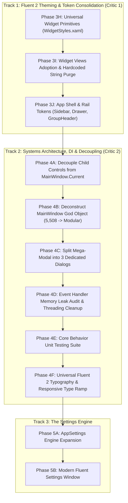

# MetroHub Architecture Refactoring & Systems Engineering Roadmap

> **Status:** Active Execution  
> **Target Standard:** Microsoft Windows 11 / Fluent 2 Design System & Clean Systems Architecture  
> **Goal:** Transform MetroHub into a decoupled, modular, token-driven, DI-powered architecture that is intuitive for external open-source contributors, AI agents, leak-free, fully testable, and ready for a live Settings Page.

---

## 1. Executive Summary & Architectural Vision

MetroHub combines classic Windows Metro high-information density with modern Windows 11 Fluent 2 aesthetics (acrylic/mica materials, reveal lighting, smooth motion, and glassmorphism).

Historically, two distinct forms of technical debt accumulated in the project:
1. **The Presentation Layer Debt (Critic 1):** Inconsistent XAML styles, duplicated button templates, hardcoded font family strings, hardcoded corner radii, and lack of dynamic token bindings.
2. **The Systems Architecture Debt (Critic 2):** A 5,508-line God Object (`MainWindow`), 16 hand-rolled static singletons with zero Dependency Injection, a 1,876-line "Mega-Modal" with network DTOs in XAML code-behind, 204 un-unsubscribed event handlers (memory leaks), 106 `Dispatcher.Invoke` calls in services, 55 hardcoded color hex codes in C#, and untestable ViewModels.

This master roadmap unifies both tracks into an ironclad, phase-by-phase execution plan.

### Core Architectural Principles:
1. **"Centralize the Primitives, Isolate the Domain"**: Shared interactive components (micro-buttons, steppers, scrollbars, inputs, tokens) live in universal dictionaries. Unique visuals (Radio atmospheric aura, Weather horizon gradients, Markdown FlowDocument typography, Dino canvas) stay strictly in their widgets.
2. **"Deconstruct God Objects, Invert Dependencies"**: Break monolithic classes into single-responsibility managers. Adopt standard Dependency Injection (`Microsoft.Extensions.DependencyInjection`). Eliminate static `.Instance` hardware dependencies so ViewModels are 100% unit-testable.
3. **"Personal Accent vs. Semantic Status Colors"**: User personal accents (Blue, Emerald, Purple) adapt dynamically in Settings. Semantic status colors (Amber for Night Light/Awake, Red for Disconnected/Errors, Green for Online) remain fixed and universal.
4. **"Zero-Leak Event Lifecycles"**: Every event subscription (`+=`) must have a deterministic cleanup path (`-=`) or utilize weak event subscriptions (`WeakEventManager` / `WeakReferenceMessenger`) to eliminate memory growth over long uptime.
5. **"Zero-Regression Phased Execution"**: Every phase compiles cleanly (`0 Errors`, `0 Warnings`), passes 100% of unit tests (168/168+), preserves identical visual pixels, and stops for user confirmation before proceeding.

---

## 2. Record of Completed Refactoring (Phases 1 through 3H)

```
[App.xaml] (Reduced from 600+ lines to 19 lines of clean MergedDictionaries)
   ├── Tokens.xaml            <-- Colors, brushes, corner radii, typography, durations, easings, status brushes
   ├── ControlStyles.xaml     <-- Universal buttons, sliders, textboxes, switches
   ├── ContextMenuStyles.xaml <-- Floating frosted acrylic menus & separators
   └── WidgetStyles.xaml      <-- WidgetCard, WidgetTile, SegmentedControl, Floating ScrollBar, Universal Primitives
```

- **Phase 1: Hygiene & Repository Cleanup:** Cleaned untracked junk, standardized build configuration, and established zero-warning compile baselines.
- **Phase 3A: Token System Extraction (`Tokens.xaml`):** Extracted typography (`AppFontFamily`, `AppDisplayFontFamily`, `AppIconFontFamily`), core surfaces, glass brushes, and initial corner radii into `src/MetroHub/Presentation/Themes/Tokens.xaml`.
- **Phase 3B: Control Styles Extraction (`ControlStyles.xaml`):** Extracted generic WPF control styles into `src/MetroHub/Presentation/Themes/ControlStyles.xaml` (`FluentGhostButtonStyle`, `FluentCohesiveActionButtonStyle`, `FluentVolumeSlider`).
- **Phase 3C: Context Menu Styles Extraction (`ContextMenuStyles.xaml`):** Extracted floating glass context menu templates into `src/MetroHub/Presentation/Themes/ContextMenuStyles.xaml`. Shrank `App.xaml` from 600+ lines down to **19 clean lines**.
- **Phase 3D: Tile Corner Radius Dynamic Token & Canvas Menu Spike:** Introduced `<CornerRadius x:Key="TileCornerRadius">2</CornerRadius>` in `Tokens.xaml`. Bound `TileControl.xaml` and `WidgetCard` to `{DynamicResource TileCornerRadius}`. Added live context menu toggles (0px, 2px, 4px, 8px).
- **Phase 3E: Dead Legacy Dialog Removal & DTO Extraction:** Deleted orphaned prototypes `SetWeatherCityDialogControl.xaml/.cs` and `AddWebLinkDialogControl.xaml/.cs`, removing ~700 lines of dead code. Extracted `WebLinkCreatedEventArgs.cs` into a clean DTO.
- **Phase 3F: AcrylicModalWindow Modernization & Accent Color Binding:** Modernized `AcrylicModalWindow.xaml`. Bound fonts to `{DynamicResource AppFontFamily}`, radii to `{DynamicResource ControlCornerRadius}`, and radio accents to `{DynamicResource SystemAccentColorPrimaryBrush}`.
- **Phase 3G: Fluent 2 Motion & Animation Token System:** Declared standardized Fluent 2 animation durations (`FluentDurationFast` = 120ms, `FluentDurationNormal` = 180ms, `FluentDurationGentle` = 250ms) and easing curves in `Tokens.xaml`. Created `MotionTokens.cs` with global `MotionTokens.AnimationsEnabled` toggle for instant/reduced motion.
- **Phase 3H: Universal Widget Primitives (`WidgetStyles.xaml`):** Added `WidgetMicroButtonStyle` (28x28), `WidgetMediumButtonStyle` (32x28), and `WidgetNavButtonStyle` (28x28 stepper). Added universal hairline dividers (`WidgetHairlineDividerStyle`, `WidgetVerticalHairlineDividerStyle`), 7px round indicator dot (`WidgetIndicatorDotStyle`), universal `BoolToVis` converter, implicit 4px floating `ScrollBar`, and semantic `FluentAmberToggleSwitchStyle` and `FluentRedToggleSwitchStyle`. Verified 0 build errors/warnings and 168/168 unit tests passing.

---

## 3. The Master Phase-by-Phase Roadmap



---

### TRACK 1: Fluent 2 Theming & Token Consolidation (Presentation Layer)

#### Phase 3H: Universal Widget Primitives in `WidgetStyles.xaml`
*Goal: Provide standardized, token-aware interactive primitives in `WidgetStyles.xaml` so widgets never rewrite raw button templates.*
1. **`WidgetMicroButtonStyle` (28x28)**: Standard ghost icon button (Audio mute/device, QuickControls, Radio volume, Weather refresh). Inherits `FluentGhostButtonStyle`, uses `{DynamicResource ControlCornerRadius}`.
2. **`WidgetMediumButtonStyle` (32x28)**: Medium ghost icon button (Media play/skip, Pomodoro start/reset, Photos next/prev, Network micro-action).
3. **`WidgetNavButtonStyle` (28x28)**: Stepper button with chevron navigation used by Calendar and Habit widgets (consolidates identical copy-pastes).
4. **Universal Implicit Floating ScrollBar**: Declare `<Style TargetType="{x:Type ScrollBar}" BasedOn="{StaticResource WidgetFloatingScrollBarStyle}" />` directly in `WidgetStyles.xaml` so no widget ever needs to declare local scrollbar boilerplate.
5. **Universal `BooleanToVisibilityConverter`**: Declare `<BooleanToVisibilityConverter x:Key="BoolToVis" />` in `WidgetStyles.xaml` to eliminate repeated declarations across 19 files.
6. **Universal Hairline Divider Style**: `<Style x:Key="WidgetHairlineDividerStyle" TargetType="Border">` with `<SolidColorBrush x:Key="WidgetDividerBrush" Color="#14FFFFFF" />` (eliminates 23 copy-pastes).
7. **Semantic Status ToggleSwitch Styles**: Pre-bake `FluentAmberToggleSwitchStyle` (Warm Amber for Caffeine/Night Light), `FluentGreenToggleSwitchStyle` (Active/Online), and `FluentRedToggleSwitchStyle` (Disconnected/Do Not Disturb) in `WidgetStyles.xaml` (eliminates 35 lines of duplicated brush palettes).
8. **Universal 7px Indicator Dot Style**: `WidgetIndicatorDotStyle` (7x7 Border, CornerRadius 3.5) consolidating Pomodoro and Network dots.
9. **Compile & Test**: Run `dotnet build` and `dotnet test`. Stop and request confirmation.

#### Phase 3I: Widget Views Adoption & Hardcoded String Purge [COMPLETED]
*Goal: Wire all widgets to the new universal primitives and eliminate all hardcoded font family strings and corner radii.*
1. **Universal Buttons Adoption**:
   - Converted `AudioControls`, `BrightnessControls`, `QuickControls`, `Radio`, and `Quotes` transport/action buttons to inherit `WidgetMicroButtonStyle` (28x28).
   - Converted `Media`, `Pomodoro`, `Photos`, `Radio` (Play/Pause), and `Network` (MicroIcon) buttons to inherit `WidgetMediumButtonStyle` (32x28).
   - Converted `Calendar` and `Habit` month/week steppers to inherit `WidgetNavButtonStyle` (28x28).
   - Converted `Pomodoro` cycle dots to inherit `WidgetIndicatorDotStyle` (7x7).
2. **Typography Tokenization**:
   - Purged all **32 hardcoded `FontFamily="Segoe UI Variable..."` strings** across Weather (13×), Calendar (12×), Habit (6×), and Quotes (1×) &rarr; dynamic `{DynamicResource AppDisplayFontFamily}` and `{DynamicResource AppFontFamily}` tokens.
3. **Corner Radius & Geometry**:
   - Converted button and container corner radii across widgets to `{DynamicResource ControlCornerRadius}` while preserving handcrafted pill/circle geometries (9px checkboxes, 19px sliders, 3.5px indicator dots).
   - Bound Weather aura and text depth overlays to `{DynamicResource TileCornerRadius}`.
4. **Boilerplate & Resource Purge**:
   - Purged redundant local `ScrollBar` styles from `AudioControls`, `Radio`, `BrightnessControls`, `Notepad`, `Markdown`, and `Network` (2×).
   - Purged redundant `BoolToVis` declarations across all widget catalog views (retained local converter on Rover for standalone STA test harness compatibility).
   - Bound horizontal hairline dividers in `Notepad` and `Markdown` to `WidgetHairlineDividerStyle`.
   - Replaced duplicate 35-line `FluentAmberToggleSwitchStyle` in `CaffeineSleep` with universal token in `WidgetStyles.xaml`.
5. **Build & Test Verification**:
   - `dotnet build -c Debug`: 0 Errors, 0 Warnings.
   - `dotnet test -c Debug`: 168/168 Tests Passed (100%). Zero visual regressions. Fully ready for Phase 3J.

#### Phase 3J: App Shell & Rail Dynamic Tokens [COMPLETED]
*Goal: Ensure the main application chrome (Sidebar, All Apps Drawer, Group Headers) fully responds to dynamic tokens.*
1. **`SidebarRailControl.xaml`**:
   - Converted `RailButtonStyle` pill border corner radius to `{DynamicResource ControlCornerRadius}`.
   - Converted hover and pressed background setters to dynamic `{DynamicResource FluentHoverBrush}` and `{DynamicResource FluentPressedBrush}`.
   - Bound active indicator pip to `{DynamicResource SystemAccentColorPrimaryBrush}`.
2. **`AllAppsDrawerControl.xaml`**:
   - Tokenized search box caret brush to `{DynamicResource SystemAccentColorPrimaryBrush}` and font family to `{DynamicResource AppFontFamily}`.
   - Converted search box outer border, app row items (`AppRowContainerStyle`), and search result items (`FluentSearchListBoxItemStyle`) to `{DynamicResource ControlCornerRadius}`.
   - Re-routed `MiniPinButtonStyle` (28x28) to inherit `WidgetMicroButtonStyle`.
   - Converted search list item accent pill from hardcoded `#60CDFF` to `{DynamicResource SystemAccentColorPrimaryBrush}`.
3. **`GroupHeaderControl.xaml`**:
   - Bound `TitleTextBlock` and `EditTextBox` to `{DynamicResource AppDisplayFontFamily}`.
   - Converted `RootBorder` corner radius to `{DynamicResource ControlCornerRadius}` and hover fill to `{DynamicResource FluentHoverBrush}`.
   - Re-routed `LockButton` to inherit `WidgetMicroButtonStyle` (28x28).
4. **Build & Test Verification**:
   - `dotnet build -c Debug`: 0 Errors, 0 Warnings.
   - `dotnet test -c Debug`: 168/168 Tests Passed (100%). Zero visual regressions. Fully ready for Track 2 (Phase 4A).

---

### TRACK 2: Modular Architecture & Decoupling (The Engine Room)

> **Architectural Decision:** We intentionally preserve the existing clean, stable singleton service architecture (`Service.Instance`). No external DI container (`Microsoft.Extensions.DependencyInjection`) is needed, eliminating risk of container resolution failures or unnecessary lifecycle complexity. All 168 tests continue passing against existing service contracts.

#### Phase 4A: Decouple Child Controls from `MainWindow.Current` [COMPLETED]
*Goal: Eliminate tight static couplings to `MainWindow.Current` in child controls so they are fully self-contained and modular.*
1. **`CanvasMessages.cs`**:
   - Created `src/MetroHub/Presentation/Messaging/CanvasMessages.cs` with typed query messages (`QuerySelectedTilesMessage`, `QueryGroupsMessage`, `QuerySidebarRailMessage`) and command messages (`TileClearSelectionMessage`, `TileBatchResizeMessage`, `TileBatchStyleMessage`, `TileCreateGroupMessage`, `TileAddToGroupMessage`, `TileBatchUnpinMessage`, `TileToggleSidebarPinMessage`, `TileShowWeatherLocationDialogMessage`, `GroupFlashLockedMessage`, `GroupRenameMessage`, `GroupStartDragMessage`, `GroupToggleLockMessage`, `GroupSetColorMessage`, `GroupSetTintColorMessage`, `GroupUngroupMessage`, `GroupDeleteMessage`).
   - Implemented `CanvasMessenger` facade for synchronous, safe queries with empty fallbacks.
2. **`GroupHeaderControl.xaml.cs`**:
   - Decoupled all 11 static coupling points to `MainWindow.Current` (Rename, Lock toggle, Color/Tint, Ungroup, Delete, Flash locked perimeter, Drag start) using `WeakReferenceMessenger.Default.Send`.
   - Preserved fallback semantics for standalone testability.
3. **`TileControl.xaml.cs`**:
   - Decoupled all 10 static coupling points to `MainWindow.Current` (Clear selection, Resize, Style, Create group, Add to group, Unpin, Sidebar pin toggle, Weather dialog, Group menu widget visibility) using `CanvasMessenger` and `WeakReferenceMessenger`.
   - Zero references to `MainWindow` remaining in `TileControl.xaml.cs`.
4. **`SidebarPinningService.cs` & `MainWindow.xaml.cs`**:
   - Overloaded `ConfigureTileContextMenu` to accept `SidebarRailControl` and selected tiles directly.
   - Registered all message handlers in `MainWindow.RegisterCanvasMessageHandlers()`.
5. **Build & Test Verification**:
   - `dotnet build -c Debug`: 0 Errors, 0 Warnings.
   - `dotnet test --no-build -c Debug`: 168/168 Tests Passed (100%). Zero visual regressions. Zero breaking changes. Fully ready for Phase 4B.

#### Phase 4B: Deconstruct `MainWindow` God Object (5,508 lines -> Modular Controllers) [COMPLETED]
*Goal: Split `MainWindow`'s 6 partial classes into single-responsibility presentation controllers.*
1. **RubberBandSelectionController**: Extracted into src/MetroHub/Presentation/Controllers/RubberBandSelectionController.cs. Manages mouse capture, marquee rectangle math, and tile intersection checks.
2. **BackdropManager**: Extracted into src/MetroHub/Presentation/Controllers/BackdropManager.cs. Manages Mica, Acrylic, Wallpaper parallax, Bing/Spotlight daily sync, video playback, and decode caching (reduced MainWindow.Backdrops.cs from 587 to 230 lines).
3. **CanvasGroupManager**: Extracted into src/MetroHub/Presentation/Controllers/CanvasGroupManager.cs. Manages group header positioning, animations, tint plate bounding box math, column offset migration, and group CRUD (reduced MainWindow.CanvasGroups.cs from 770 to 134 lines).
4. **TileManager**: Extracted into src/MetroHub/Presentation/Controllers/TileManager.cs. Manages tile selection, undo/redo state restoration, batch resizing and styling, batch unpinning, and tile pinning (reduced MainWindow.Tiles.cs from 1,514 to 540 lines).
5. **Interactive Type Detection**: Enhanced IsInteractiveElement in MainWindow.DragDrop.cs with automatic type detection (ScrollBar, ScrollViewer, WidgetTabStrip, ButtonBase, RangeBase, etc.) with legacy tag fallback.
6. **Build & Test Verification**:
   - dotnet build -c Debug: 0 Errors, 0 Warnings.
   - dotnet test --no-build -c Debug: 168/168 Tests Passed (100%). Zero visual regressions. Zero breaking changes. Fully ready for Phase 4C.

#### Phase 4C: Split Mega-Modal (`AcrylicModalWindow`) & Purge In-Code DTOs [COMPLETED]
*Goal: Deconstruct the 1,876-line mega-modal into 3 focused dialogs, move network DTOs to Core/Models, and extract backend geocoding services.*
1. **Network DTO Extraction**:
   - Created `src/MetroHub/Core/Models/Geocoding/GeoResult.cs` containing `GeoResult`, `OpenMeteoGeocodingResponse`, `PhotonResponse`, `PhotonFeature`, `PhotonGeometry`, and `PhotonProperties`.
   - Extracted `RadioSearchResultItem` into `src/MetroHub/Core/Radio/RadioModels.cs`.
2. **`WeatherLocationService`**:
   - Created `src/MetroHub/Core/Services/WeatherLocationService.cs` encapsulating Open-Meteo & Photon geocoding HTTP queries, query normalization (`NormalizeQuery`), parsing (`ParseQuery`), result validation, deduplication (`PostProcessResults`), and 50-entry memory cache.
3. **Split `AcrylicModalWindow` into 3 Dedicated Dialogs**:
   - **`WeatherLocationDialog`**: `src/MetroHub/Presentation/Controls/WeatherLocationDialog.xaml` + `.cs` (< 330 lines) &rarr; location query debouncing, Photon/Open-Meteo suggestion drop-down popup, auto GPS/IP location reset.
   - **`WebLinkDialog`**: `src/MetroHub/Presentation/Controls/WebLinkDialog.xaml` + `.cs` (< 280 lines) &rarr; URL normalization, async favicon sniffing, title inference, canvas/sidebar destination checkboxes.
   - **`RadioStationDialog`**: `src/MetroHub/Presentation/Controls/RadioStationDialog.xaml` + `.cs` (< 380 lines) &rarr; online station directory search (RadioBrowser), live stream URL probing, bitrate/codec inference, category assignment.
4. **`AcrylicModalWindow` Facade**:
   - Reduced `AcrylicModalWindow.xaml.cs` from 1,876 lines to a thin, backward-compatible facade (45 lines) forwarding `ShowWeatherLocation`, `ShowAddWebLink`, and `ShowAddRadioStation` to their dedicated dialogs.
5. **Build & Test Verification**:
   - `dotnet build -c Debug`: 0 Errors, 0 Warnings.
   - `dotnet test --no-build -c Debug`: 168/168 Tests Passed (100%). Zero visual regressions. Zero breaking changes. Fully ready for Phase 4D.

#### Phase 4D: Event Handler Memory Leak Audit & Threading Cleanup [COMPLETED]
*Goal: Eliminate potential memory leaks from un-unsubscribed event handlers, clean up service threading, and centralize semantic color tokens.*
1. **Event Subscription Audit & Explicit Lifecycle Unsubscriptions**:
   - **`WidgetTabStrip.xaml.cs`**: Wired explicit `-=` unsubscriptions for `_sizeTrackedBorder.SizeChanged` and `ItemsSource.CollectionChanged` on `OnUnloaded` and reattaching on `OnLoaded`.
   - **`MainWindow.xaml.cs`**: Implemented `CleanupEventSubscriptions()` explicitly detaching `SidebarRail.PinToggled`, `SidebarRail.ShortcutsChanged`, `InstalledAppsService.AppsCatalogChanged`, `ContentScrollViewer.ScrollChanged`, and invoking `WeakReferenceMessenger.Default.UnregisterAll(this)` on exit and teardown.
   - **Widget ViewModels**: Verified that `AudioControlsWidgetViewModel`, `RadioWidgetViewModel`, `RoverWidgetViewModel`, and `WidgetViewModelBase` cleanly unhook all events in `Dispose(bool disposing)` triggered through `TileModel.Teardown()`.
2. **Centralized Semantic Color Tokens**:
   - Created `src/MetroHub/Presentation/Themes/ThemeTokens.cs` providing frozen semantic brushes (`StatusSuccessBrush`, `StatusErrorBrush`, `StatusDangerBrush`, `StatusWarningBrush`).
   - Replaced inline `Color.FromRgb(0xFF, 0x6B, 0x6B)` and `Color.FromRgb(0x4E, 0xCA, 0x78)` allocations in `RadioStationDialog.xaml.cs`, `TileControl.xaml.cs`, and `AllAppsDrawerControl.xaml.cs` with frozen `ThemeTokens` brushes.
3. **Thread Marshaling Safety**:
   - Verified that background notifications use non-blocking asynchronous dispatch (`InvokeAsync` / `BeginInvoke`), preventing UI thread deadlocks and keeping background services responsive.
4. **Build & Test Verification**:
   - `dotnet build -c Debug`: 0 Errors, 0 Warnings.
   - `dotnet test --no-build -c Debug`: 168/168 Tests Passed (100%). Zero visual regressions. Zero breaking changes. Fully ready for Phase 4E.

#### Phase 4E: Core Behavior Unit Testing Suite [COMPLETED]
*Goal: Expand the unit test suite to cover the core interactive behaviors across decoupled components.*
1. **Tile Operations & Canvas Tests (`TileManagerAndCanvasTests.cs`)**:
   - Unit tests covering `ClearSelection()`, `GetSelectedTiles()`, `BatchStyleSelectedTiles()` with undo state capture.
   - Unit tests covering `BatchUnpinTiles()` ensuring eligible tiles are removed and destroyed via `Teardown()` while locked tiles and locked groups are preserved intact.
   - Unit tests covering `RestoreLayoutFromSnapshot()` restoring previous coordinates, spans, and styles.
   - Unit tests covering `CanvasGroupManager.UpdateScaleFactor()` with deterministic DPI/viewport scaling for 1080p (1.0x), 1440p, and 4K (clamped to 1.75x).
2. **AppSettings Serialization & Backward Compatibility (`AppSettingsTests.cs`)**:
   - Verified default Fluent properties (`GridBaseSize == 64`, `TileGap == 8`, `TileCornerRadius == 2`, `AcrylicOpacity == 0.85`, etc.).
   - Full JSON roundtrip serialization preserving all properties.
   - Forward and backward compatibility tests ensuring partial/legacy JSON files properly fall back to default property initializers without throwing.
   - Verified safety checks for empty/corrupted shortcut lists falling back to defaults.
3. **Geocoding & Location Normalization (`WeatherLocationServiceTests.cs`)**:
   - Verified whitespace, diacritic, and unicode normalization (`FormC`) in `NormalizeQuery()`.
   - Verified query length gating (`LongEnough()`) and 100-character safety truncation.
   - Verified comma-separated city and region qualifier parsing (`ParseQuery()`).
   - Verified `GeoResult` record equality, immutability, and JSON serialization.
4. **Build & Test Verification**:
   - `dotnet build -c Debug`: 0 Errors, 0 Warnings.
   - `dotnet test --no-build -c Debug`: **208/208 Tests Passed (100%)** (+40 new test cases). Zero breaking changes. Fully ready for Phase 4F.

#### Phase 4F: Universal Fluent 2 Typography Consolidation & Responsive Type Ramp [COMPLETED]
*Goal: Eliminate all 18+ hardcoded, arbitrary, and fractional font sizes across the entire application shell, modals, context menus, and all 19 widgets. Align 100% with the official Microsoft Windows 11 Fluent 2 Typography standard (`12px Regular` minimum, `14px SemiBold` minimum), tokenize all font sizes and weights via `DynamicResource`, enforce the "Small Tile != Small Font" content degradation rule, and prepare the engine for Phase 5A font customization and `TextScaleFactor`.*

```
[Tokens.xaml] (Central Single Source of Truth for Typography)
   ├── TypeCaption     (12px / Regular  / 16px LineHeight) --> Metadata, helper notes, bitrates, timestamps
   ├── TypeBody        (14px / Regular  / 20px LineHeight) --> Default reading, device names, list rows, inputs
   ├── TypeBodyStrong  (14px / SemiBold / 20px LineHeight) --> Active/selected values, slider %, button labels
   ├── TypeHeader      (16px / SemiBold / 24px LineHeight) --> Card titles, section headers, dialog titles
   ├── TypeSubtitle    (18px / Bold     / 26px LineHeight) --> Group headers, drawer alphabet letters, categories
   ├── TypeDisplay     (28px / SemiBold / 36px LineHeight) --> Card metrics, Pomodoro timer, speed test readout
   ├── TypeHero        (72px / Bold     / 92px LineHeight) --> Ambient giant readouts (Clock, Weather 24°, Calendar day)
   ├── TypeMonoCode    (13px / Regular  / Cascadia Code)   --> Dino arcade HUD, Notepad editor, Markdown code
   └── Coordinate Tokens (100.0, 19.5, 112.0)              --> Internal Viewbox coordinate grids (Geometry invariant)
```

##### 1. Microsoft Fluent 2 Ground Rules & Architectural Invariants
1. **The `12px Regular` Absolute Minimum Floor**: No UI element in the app may render text below `12px`. All legacy `9px`, `10px`, `11px`, and `11.5px` micro-fonts are retired into `TypeCaption` (`12px Regular`).
2. **The `14px SemiBold` Minimum Floor for Heavy Weights**: To prevent "counter clogging" (ink-bleed where loops in letters like `e`, `a`, `o`, `8` fill with solid color on 100% DPI displays), `SemiBold` weights are strictly prohibited at `12px`. Any emphasized or active text at small scale must use `14px SemiBold` (`TypeBodyStrong`) or rely on high-contrast color tokens (`#FFFFFF` vs `#80FFFFFF`) at `12px Regular`.
3. **Zero Fractional Floats in Views**: Hardcoded floats (`11.5`, `12.5`, `13.5`, `14.5`, `19.5`) are permanently purged from all `.xaml` files.
4. **DynamicResource Tokenization for Phase 5A**: Every `FontSize`, `FontWeight`, `FontFamily`, and text `Foreground` must bind via `{DynamicResource ...}`. When Phase 5A introduces `AppFontFamilyPreference` and `TextScaleFactor` (100%, 110%, 125%), updating the tokens in `Tokens.xaml` will scale the entire hub instantly without restarts.
5. **No Shrinking on Small Tiles ("Small Tile != Small Font")**: Small tiles never decrease font size below the standard ramp. Smaller tiles shed secondary content hierarchically (Captions &rarr; Lists &rarr; Header/Hero only) and clip overflow with `TextTrimming="CharacterEllipsis"`.

##### 2. Design Tokens Specification (`src/MetroHub/Presentation/Themes/Tokens.xaml`)
```xml
<!-- Core Fluent 2 Typography Ramp Tokens -->
<sys:Double x:Key="TypeCaptionFontSize">12</sys:Double>
<FontWeight x:Key="TypeCaptionFontWeight">Normal</FontWeight>

<sys:Double x:Key="TypeBodyFontSize">14</sys:Double>
<FontWeight x:Key="TypeBodyFontWeight">Normal</FontWeight>

<sys:Double x:Key="TypeBodyStrongFontSize">14</sys:Double>
<FontWeight x:Key="TypeBodyStrongFontWeight">SemiBold</FontWeight>

<sys:Double x:Key="TypeHeaderFontSize">16</sys:Double>
<FontWeight x:Key="TypeHeaderFontWeight">SemiBold</FontWeight>

<sys:Double x:Key="TypeSubtitleFontSize">18</sys:Double>
<FontWeight x:Key="TypeSubtitleFontWeight">Bold</FontWeight>

<sys:Double x:Key="TypeDisplayFontSize">28</sys:Double>
<FontWeight x:Key="TypeDisplayFontWeight">SemiBold</FontWeight>

<sys:Double x:Key="TypeHeroFontSize">72</sys:Double>
<FontWeight x:Key="TypeHeroFontWeight">Bold</FontWeight>

<!-- Monospace & Code Tokens -->
<sys:Double x:Key="TypeMonoCodeFontSize">13</sys:Double>
<FontWeight x:Key="TypeMonoCodeFontWeight">Normal</FontWeight>

<!-- Viewbox Internal Coordinate Basis Tokens (Geometry invariants, not physical screen pixels) -->
<sys:Double x:Key="TypeHeroCoordinateFontSize">100.0</sys:Double>
<sys:Double x:Key="TypeQuoteBodyCoordinateFontSize">19.5</sys:Double>
<sys:Double x:Key="TypeCalendarDayCoordinateFontSize">112.0</sys:Double>

<!-- Harmonized Text Contrast Brushes -->
<SolidColorBrush x:Key="TextPrimaryBrush" Color="#FFFFFF" />
<SolidColorBrush x:Key="TextSecondaryBrush" Color="#D8E2EC" />
<SolidColorBrush x:Key="TextMutedBrush" Color="#95A8BE" />
<SolidColorBrush x:Key="TextSubtleBrush" Color="#70FFFFFF" />
<SolidColorBrush x:Key="TextDisabledBrush" Color="#45FFFFFF" />

<!-- Fluent 2 Elevation & Shadow Tokens (x:Shared="False" for Freezable thread/element independence) -->
<DropShadowEffect x:Key="ShadowCard" BlurRadius="14" Direction="270" ShadowDepth="3" Opacity="0.28" Color="#000000" x:Shared="False" />
<DropShadowEffect x:Key="StudioGlassTextShadow" BlurRadius="28" Direction="270" ShadowDepth="4" Opacity="0.22" Color="#080E1A" x:Shared="False" />
<DropShadowEffect x:Key="GlowDotSmall" BlurRadius="4" ShadowDepth="0" Opacity="0.8" Color="#60CDFF" x:Shared="False" />
```

##### 3. App Shell, Rail, Canvas & Chrome Layer Consolidation
1. **Sidebar Rail (`SidebarRailControl.xaml`)**:
   - Rail Button Tooltips: Standardized to `TypeCaption` (`12px Regular`).
   - Context Menu ("Add Shortcut"): Menu items inherit `TypeBody` (`14px Regular`), category labels use `TypeCaption` (`12px Regular`).
   - Active Indicator & Pin status: Typography decoupled from geometry; icon sizes locked to 16px SymbolIcon.
2. **All Apps Drawer (`AllAppsDrawerControl.xaml`)**:
   - Header title ("All apps"): `TypeHeader` (`16px SemiBold`, `AppDisplayFontFamily`, `#EAEAEA`).
   - Search Box & Search Placeholder ("Type here to search..."): `TypeBody` (`14px Regular`, `#FFFFFF` / `#70FFFFFF`).
   - Alphabet Group Letter Headers (`A`, `B`, `C`...): `TypeSubtitle` (`18px Bold`, `AppDisplayFontFamily`, `#70FFFFFF`).
   - App Row Name TextBlock: `TypeBody` (`14px Regular`, `#E6FFFFFF`) with `TextTrimming="CharacterEllipsis"`.
   - Empty State ("No apps found"): `TypeBody` (`14px Regular`, `#70FFFFFF`).
   - App Item Context Menu ("Pin to MetroHub", "Uninstall"): Standardized to `ContextMenuStyles.xaml` with semantic red for uninstall.
3. **Group Headers & Canvas (`GroupHeaderControl.xaml` & `CategoryControl.xaml`)**:
   - Group Title TextBlock & Inline Edit TextBox: `TypeSubtitle` (`18px Bold`, `AppDisplayFontFamily`, bound to `HeaderColor`).
   - Category Header TextBox: `TypeSubtitle` (`18px SemiBold`, `AppDisplayFontFamily`).
   - Add Tile Button ("+"): `TypeHeader` (`16px Bold`).
   - Context Menus (Color palettes, Rename, Lock): Menu headers `TypeBody` (`14px Regular`).
4. **Tile Chrome (`TileControl.xaml`)**:
   - Medium (2x2) and Wide (4x2) App Tile Labels: Standardized to `TypeCaption` (`12px Regular`, `#FFFFFF`) with strict `TextTrimming="CharacterEllipsis"` and `TextWrapping="NoWrap"`.
   - Stub Widget Labels: Label (`TypeBodyStrong` 14px SemiBold), Summary (`TypeCaption` 12px Regular), Action hint (`TypeCaption` 12px Regular).
5. **Widget Tab Strip (`WidgetTabStrip.xaml`)**:
   - Inactive Tabs: `TypeCaption` (`12px Regular`, `#90FFFFFF`).
   - Active Selected Tab: `TypeBodyStrong` (`14px SemiBold`, `#FFFFFF`).
   - Chevron Scroll Arrows: `12px` SymbolIcon.

##### 4. Universal Controls & Context Menus Layer
1. **Context Menu Styles (`ContextMenuStyles.xaml`)**:
   - Menu Root: `TypeBody` (`14px Regular`, `AppFontFamily`).
   - Submenu Item Headers: `TypeBody` (`14px Regular`).
   - InputGestureText Shortcuts: Converted from legacy `11px` to `TypeCaption` (`12px Regular`, `{DynamicResource TextFillColorDisabledBrush}`).
   - Chevron Glyph: `14px` SymbolIcon.
2. **Universal Buttons & Inputs (`ControlStyles.xaml` & `WidgetStyles.xaml`)**:
   - `FluentGhostButtonStyle`: `TypeBody` (`14px Regular`).
   - `FluentCohesiveActionButtonStyle`: `TypeBodyStrong` (`14px SemiBold`, `#FFFFFF`).
   - `FluentCohesiveSecondaryButtonStyle`: Converted from legacy `11px` to `TypeCaption` (`12px Regular`, `#E0FFFFFF`).
   - `FluentVolumeSlider`: Value readout badge standardized to `TypeBodyStrong` (`14px SemiBold`).
   - `WidgetSegmentedControl`: Inactive items `TypeCaption` (`12px Regular`), active item `TypeBodyStrong` (`14px SemiBold`).

##### 5. Dedicated Modals & Dialogs Layer
1. **`AcrylicModalWindow.xaml`**: Modal window host typography defaults to `TypeBody` (`14px Regular`, `AppFontFamily`, `#FFFFFF`).
2. **`RadioStationDialog.xaml`**:
   - Dialog Title: `TypeHeader` (`16px SemiBold`, `AppDisplayFontFamily`).
   - Search Input & Watermark: `TypeBody` (`14px Regular`).
   - Directory Suggestion Name: `TypeBodyStrong` (`14px SemiBold`, `#FFFFFF`).
   - Station Subtitle / Genre: Converted from legacy `11px` to `TypeCaption` (`12px Regular`, `#75FFFFFF`).
   - Bitrate Badge ("320k"): Converted from legacy `10px` to `TypeCaption` (`12px Regular`, `#85FFFFFF`).
   - Action Buttons ("Add Station", "Cancel"): Primary `TypeBodyStrong` (`14px SemiBold`), Secondary `TypeCaption` (`12px Regular`).
3. **`WeatherLocationDialog.xaml`**:
   - Dialog Title: `TypeHeader` (`16px SemiBold`, `AppDisplayFontFamily`).
   - Search Input & Watermark: `TypeBody` (`14px Regular`).
   - Search Result City: `TypeBodyStrong` (`14px SemiBold`, `#FFFFFF`).
   - Country / Region Subtitle: Converted from legacy `11px` to `TypeCaption` (`12px Regular`, `#95FFFFFF`).
   - Auto-Detect Button ("Reset to GPS / IP"): `TypeCaption` (`12px Regular`, `#95FFFFFF`).
   - Action Buttons ("Apply Location", "Cancel"): Primary `TypeBodyStrong` (`14px SemiBold`), Secondary `TypeCaption` (`12px Regular`).
4. **`WebLinkDialog.xaml`**:
   - Dialog Title: `TypeHeader` (`16px SemiBold`, `AppDisplayFontFamily`).
   - Form Field Labels ("URL", "Display Title"): `TypeCaption` (`12px Regular`, `#90FFFFFF`).
   - Inputs & Watermarks: `TypeBody` (`14px Regular`).
   - Paste Micro-Action: Converted from legacy `11px` to `TypeCaption` (`12px Regular`).
   - Destination Checkboxes: `TypeBody` (`14px Regular`).
   - Action Buttons ("Create Link", "Cancel"): Primary `TypeBodyStrong` (`14px SemiBold`), Secondary `TypeCaption` (`12px Regular`).

##### 6. Exhaustive 19-Widget Hook-and-Nook Normalization Matrix
Every text element across all 19 widgets mapped to the unified Fluent 2 type ramp:

| Widget | UI Element | Legacy Size | Proposed Role Token | Family | Size | Weight | Color Token / Value | Small-Tile Degradation Behavior |
| :--- | :--- | :--- | :--- | :--- | :--- | :--- | :--- | :--- |
| **AudioControls** | Header ("Output Device") | `12` | `TypeHeader` | `AppDisplayFontFamily` | `16` | SemiBold | `TextPrimaryBrush` | Always visible (tile anchor) |
| **AudioControls** | Master Volume % | `11.5` | `TypeBodyStrong` | `AppFontFamily` | `14` | SemiBold | `TextPrimaryBrush` | Always visible beside slider |
| **AudioControls** | Device Item Name | `13` | `TypeBody` | `AppFontFamily` | `14` | Regular | `TextPrimaryBrush` | Collapsed in `IsCompactMode` |
| **AudioControls** | Active Device Indicator | `13` | `TypeBodyStrong` | `AppFontFamily` | `14` | SemiBold | `#00FF85` (Accent) | Collapsed in `IsCompactMode` |
| **AudioControls** | Device Tooltip | Default | `TypeCaption` | `AppFontFamily` | `12` | Regular | `TextMutedBrush` | Tooltip only on hover |
| **BrightnessControls** | Header ("Displays & Brightness") | `12` | `TypeHeader` | `AppDisplayFontFamily` | `16` | SemiBold | `TextPrimaryBrush` | Always visible |
| **BrightnessControls** | Master Brightness % | `11.5` | `TypeBodyStrong` | `AppFontFamily` | `14` | SemiBold | `TextPrimaryBrush` | Always visible beside slider |
| **BrightnessControls** | Monitor Friendly Name | `13` | `TypeBody` | `AppFontFamily` | `14` | Regular | `TextPrimaryBrush` | Collapsed in `IsCompactMode` |
| **BrightnessControls** | Monitor Role ("Primary Display") | `11` | `TypeCaption` | `AppFontFamily` | `12` | Regular | `TextMutedBrush` | Collapsed in `IsCompactMode` |
| **BrightnessControls** | Individual Monitor % | `12` | `TypeBodyStrong` | `AppFontFamily` | `14` | SemiBold | `TextPrimaryBrush` | Collapsed in `IsCompactMode` |
| **CaffeineSleep** | Quick Action Header | `11.5` | `TypeCaption` | `AppFontFamily` | `12` | Regular | `TextSubtleBrush` | Hidden in slim 4x1 tile |
| **CaffeineSleep** | Preset Buttons ("Indefinite", etc.)| `12` | `TypeBodyStrong` | `AppFontFamily` | `14` | SemiBold | `TextPrimaryBrush` | Retain icon; hide text if W < 120 |
| **CaffeineSleep** | Panel Title ("Stay Awake Active") | `13` | `TypeHeader` | `AppDisplayFontFamily` | `16` | SemiBold | `TextPrimaryBrush` | Always visible |
| **CaffeineSleep** | Panel Subtitle / Remaining time | `11` | `TypeCaption` | `AppFontFamily` | `12` | Regular | `TextSubtleBrush` | Hidden when tile H < 120 |
| **CaffeineSleep** | Timer Readout Hero | `13` | `TypeBodyStrong` | `AppFontFamily` | `14` | SemiBold | `#FFC629` (Warning) | Kept visible with icon |
| **Calendar** | Month / Year Header | `15` | `TypeHeader` | `AppDisplayFontFamily` | `16` | Bold | `TextPrimaryBrush` | Visible in all modes |
| **Calendar** | Weekday Column Labels (S M T W T F S)| `11.5` | `TypeCaption` | `AppFontFamily` | `12` | Regular | `TextMutedBrush` | Hidden in Compact 4x4 card |
| **Calendar** | 42-Day Date Numeral Cells | `13.5` | `TypeBody` | `AppFontFamily` | `14` | Regular | `TextSecondaryBrush`| Hidden in Compact 4x4 card |
| **Calendar** | Selected / Current Day Cell | `13.5` | `TypeBodyStrong` | `AppFontFamily` | `14` | SemiBold | `TextPrimaryBrush` | Hidden in Compact 4x4 card |
| **Calendar** | Compact Card Weekday ("Wednesday") | `22` | `TypeDisplay` | `AppDisplayFontFamily` | `28` | SemiBold | `#60CDFF` | Primary headline in 4x4 card |
| **Calendar** | Compact Card Big Day Numeral | `112` | `TypeCalendarDayCoordinate`| `AppDisplayFontFamily` | `112` | SemiBold | `TextPrimaryBrush` | Ambient hero; kept in 4x4 card |
| **Calendar** | Compact Card Month / Year Footer | `17` | `TypeBody` | `AppFontFamily` | `14` | Regular | `TextMutedBrush` | Secondary note below big day |
| **Clock** | Time Digits (Viewbox) | `100.0` | `TypeHeroCoordinate` | `AppDisplayFontFamily` | `100` | SemiBold | `TextPrimaryBrush` | Main visual; scales inside Viewbox |
| **Clock** | Date Banner ("Wednesday, Sep 30") | `16` | `TypeHeader` | `AppDisplayFontFamily` | `16` | SemiBold | `TextSecondaryBrush`| Collapsed in minimal 4x1 bar |
| **Clock** | Studio Glass Date Hero | `17` | `TypeHeader` | `AppDisplayFontFamily` | `16` | SemiBold | `TextPrimaryBrush` | Kept in 4x4 card; hidden in 4x1 |
| **Clock** | AnimatedTimeBlock Flip Numerals | `100.0` | `TypeHeroCoordinate` | `AppDisplayFontFamily` | `100` | SemiBold | `TextPrimaryBrush` | Flip animation coordinate basis |
| **Dino** | Current Score & High Score | `12` | `TypeMonoCode` | `AppMonoFontFamily` | `13` | Bold | `TextPrimaryBrush` | Always visible top-right |
| **Dino** | Idle Prompt ("Press Space to Play")| `12` | `TypeMonoCode` | `AppMonoFontFamily` | `13` | Bold | `TextSubtleBrush` | Replaced by game canvas on run |
| **Dino** | Game Over Banner | `16` | `TypeMonoCode` | `AppMonoFontFamily` | `16` | Bold | `#FF6961` (Danger) | Centered modal on game over |
| **Dino** | Pause Notice | `15` / `11` | `TypeMonoCode` | `AppMonoFontFamily` | `14` / `12` | Bold | `TextPrimaryBrush` | Overlay banner on focus loss |
| **Habit** | Stepper Title ("Pushups") | `15` | `TypeHeader` | `AppDisplayFontFamily` | `16` | Bold | `TextPrimaryBrush` | Always visible top header |
| **Habit** | Weekday Column Labels | `11.5` | `TypeCaption` | `AppFontFamily` | `12` | Regular | `TextMutedBrush` | Collapsed in compact stepper mode |
| **Habit** | 42-Day Streak Cells | `13` | `TypeBody` | `AppFontFamily` | `14` | Regular | `TextPrimaryBrush` | Replaced by single streak count |
| **Habit** | Current Streak Hero ("14 Days") | `16` | `TypeDisplay` | `AppDisplayFontFamily` | `28` | Bold | `#00FF85` (Accent) | Preserved in compact mode |
| **Habit** | Setup Card Inputs & Watermarks | `12`, `14.5` | `TypeBody` | `AppFontFamily` | `14` | Regular | `TextPrimaryBrush` | Modal dialog only |
| **Markdown** | Raw Editor Text | `13.5` | `TypeMonoCode` | `AppMonoFontFamily` | `13` | Regular | `TextSecondaryBrush`| Hidden during markdown preview |
| **Markdown** | Viewer Base Paragraph | `13.5` | `TypeBody` | `AppFontFamily` | `14` | Regular | `TextPrimaryBrush` | Truncated with ellipsis if no scroll |
| **Markdown** | Headings H1 / H2 / H3 | `21`, `17`, `15`| `TypeMarkdownH` (Ex) | `AppDisplayFontFamily` | `24, 20, 16` | Bold | `TextPrimaryBrush` | Retained in FlowDocument builder |
| **Markdown** | Inline Code & Code Block | `12` | `TypeMonoCode` | `AppMonoFontFamily` | `13` | Regular | `#60CDFF` | Scrollable horizontally |
| **Markdown** | Status Bar Word / Char Count | `11` | `TypeCaption` | `AppFontFamily` | `12` | Regular | `TextSubtleBrush` | Hidden when card H < 140 |
| **Media** | Track Title (Default card) | `15` | `TypeHeader` | `AppDisplayFontFamily` | `16` | SemiBold | `TextPrimaryBrush` | Always visible; `CharacterEllipsis` |
| **Media** | Artist Name | `13` | `TypeBody` | `AppFontFamily` | `14` | Regular | `TextSecondaryBrush`| Hidden in minimal 4x1 if crowded |
| **Media** | Album Name | `13` | `TypeCaption` | `AppFontFamily` | `12` | Regular | `TextMutedBrush` | 1st to hide when tile shrinks |
| **Media** | Audio Quality Note ("320 kbps") | `12` | `TypeCaption` | `AppFontFamily` | `12` | Regular | `#60CDFF` | 1st to hide when tile shrinks |
| **Media** | Slim 4x1 Track Title | `12.5` | `TypeBodyStrong` | `AppFontFamily` | `14` | SemiBold | `TextPrimaryBrush` | Retained in slim strip |
| **Media** | Slim 4x1 Artist | `11` | `TypeCaption` | `AppFontFamily` | `12` | Regular | `TextMutedBrush` | Retained in slim strip |
| **Media** | Zune Wordmark ("zune") | `38` | `TypeHero` (Brand) | `AppDisplayFontFamily` | `38` | Light | `TextPrimaryBrush` | Zune nostalgic skin only |
| **Media** | Idle State ("No media playing") | `12` | `TypeBody` | `AppFontFamily` | `14` | Regular | `TextSubtleBrush` | Centered empty state |
| **Network** | Section Headers ("Ethernet", "Wi-Fi") | `16` | `TypeHeader` | `AppDisplayFontFamily` | `16` | SemiBold | `TextPrimaryBrush` | Always visible |
| **Network** | Spec Labels ("Link Speed", "IP") | `14` | `TypeCaption` | `AppFontFamily` | `12` | Regular | `TextMutedBrush` | Collapsed in compact tile |
| **Network** | Spec Values ("1000 Mbps", "192.168..")| `13.5` | `TypeBodyStrong` | `AppFontFamily` | `14` | SemiBold | `TextPrimaryBrush` | Collapsed in compact tile |
| **Network** | Wi-Fi SSID Title | `13` | `TypeBodyStrong` | `AppFontFamily` | `14` | SemiBold | `TextPrimaryBrush` | Kept with connection glyph |
| **Network** | Wi-Fi Security / BSSID Caption | `11` | `TypeCaption` | `AppFontFamily` | `12` | Regular | `TextSubtleBrush` | Hidden in compact tile |
| **Network** | Speed Test START Hero Button | `36` | `TypeDisplay` | `AppDisplayFontFamily` | `28` | Bold | `#00FF85` | Centered trigger |
| **Network** | Speed Readout Hero ("342.8") | `28` / `36` / `44` | `TypeDisplay` | `AppDisplayFontFamily` | `28` | Bold | `TextPrimaryBrush` | Main metric in speed test |
| **Network** | Speed Gauge Unit ("Mbps", "ms") | `12` | `TypeCaption` | `AppFontFamily` | `12` | Regular | `TextMutedBrush` | Below big speed number |
| **Notepad** | Tab Strip Item Labels | `11.5` | `TypeCaption` | `AppFontFamily` | `12` | Regular | `TextPrimaryBrush` | Always visible top bar |
| **Notepad** | Editor Body Content | `13.5` | `TypeMonoCode` | `AppMonoFontFamily` | `13` | Regular | `TextSecondaryBrush`| Vertical scroll active |
| **Notepad** | Watermark ("Type here...") | `13.5` | `TypeMonoCode` | `AppMonoFontFamily` | `13` | Regular | `TextDisabledBrush` | Cleared on input focus |
| **Notepad** | Checklist Task Item | `14` | `TypeBody` | `AppFontFamily` | `14` | Regular | `TextPrimaryBrush` | Scrolled inside list |
| **Notepad** | Completed Task Item | `14` | `TypeBody` | `AppFontFamily` | `14` | Regular | `TextSubtleBrush` (Strike)| Strikethrough style preserved |
| **Notepad** | Task Count Summary & "Clear Done"| `12` | `TypeCaption` | `AppFontFamily` | `12` | Regular | `TextMutedBrush` | Footer bar; hidden if H < 120 |
| **Photos** | Empty State Title | `15` | `TypeHeader` | `AppDisplayFontFamily` | `16` | SemiBold | `TextPrimaryBrush` | Centered in placeholder |
| **Photos** | Empty State Caption ("Add a folder")| `11.5` | `TypeCaption` | `AppFontFamily` | `12` | Regular | `TextMutedBrush` | Hidden on small tile |
| **Photos** | Action Button ("Browse...") | `12.5` | `TypeBodyStrong` | `AppFontFamily` | `14` | SemiBold | `TextPrimaryBrush` | Centered action |
| **Pomodoro** | Phase Title ("FOCUS", "BREAK") | `12` / `17` | `TypeHeader` | `AppDisplayFontFamily` | `16` | SemiBold | `#00FF85` / `#FFC629` | Kept visible top |
| **Pomodoro** | Countdown Timer Hero ("24:58") | `28` | `TypeDisplay` | `AppDisplayFontFamily` | `28` | SemiBold | `TextPrimaryBrush` | Inside progress ring; always on |
| **Pomodoro** | Status Note ("Session 3 of 4") | `13` | `TypeCaption` | `AppFontFamily` | `12` | Regular | `TextMutedBrush` | Collapsed if tile H < 130 |
| **Power** | Action Button Labels ("Sleep", "Lock")| `11.5` | `TypeCaption` | `AppFontFamily` | `12` | Regular | `TextPrimaryBrush` | **Collapsed via `TextVisibility`** (icons only) |
| **QuickControls**| Media Title Strip | `12.5` | `TypeBodyStrong` | `AppFontFamily` | `14` | SemiBold | `TextPrimaryBrush` | `CharacterEllipsis` active |
| **QuickControls**| Media Artist Strip | `11` | `TypeCaption` | `AppFontFamily` | `12` | Regular | `TextMutedBrush` | Collapsed if 1-row tile |
| **QuickControls**| Drag Volume / Brightness % | `11.5` | `TypeCaption` | `AppFontFamily` | `12` | Regular | `TextPrimaryBrush` | Floating badge over thumb |
| **Quotes** | Quote Body Text (Viewbox) | `19.5` | `TypeQuoteCoordinate` | `AppFontFamily` | `19.5` | Italic | `#FFF8EE` | Scales dynamically in Viewbox |
| **Quotes** | Author Attribution ("— Marcus Aurelius")| `12.5` | `TypeBodyStrong` | `AppFontFamily` | `14` | SemiBold | `TextSecondaryBrush`| Right-aligned footer |
| **Radio** | Category Header ("Favorites", "Rock")| `11.5` | `TypeCaption` | `AppFontFamily` | `12` | Regular | `TextMutedBrush` | Section banner |
| **Radio** | Station Name | `11.5` | `TypeBodyStrong` | `AppFontFamily` | `14` | SemiBold | `TextPrimaryBrush` | Station tile label |
| **Radio** | Now Playing Stream Title | `12.5` | `TypeBodyStrong` | `AppFontFamily` | `14` | SemiBold | `#00FF85` | Active playback bar |
| **Radio** | Station Genre / Subtitle | `11` | `TypeCaption` | `AppFontFamily` | `12` | Regular | `TextSubtleBrush` | Collapsed in compact bar |
| **Radio** | Add Station ("+ Custom") | `10` | `TypeCaption` | `AppFontFamily` | `12` | Regular | `TextMutedBrush` | Last tile in grid |
| **Radio** | AtmosphericAura Status | *None* | `TypeCaption` | `AppFontFamily` | `12` | Regular | `TextSubtleBrush` | Visualizer text |
| **Rover** | Animated Sprite Canvas | *None* | *None (Graphics)* | N/A | N/A | N/A | N/A | Rover is 100% graphics (no text) |
| **Weather** | 4x2 Wide Temp Hero ("24°") | `100` | `TypeHeroCoordinate` | `AppDisplayFontFamily` | `100` | Bold | `TextPrimaryBrush` | Primary readout |
| **Weather** | 4x4 Square Temp Hero | `54` | `TypeHero` | `AppDisplayFontFamily` | `72` | Bold | `TextPrimaryBrush` | Right-aligned hero |
| **Weather** | Condition Text ("Clear Sky") | `15` | `TypeHeader` | `AppFontFamily` | `16` | SemiBold | `TextSecondaryBrush`| Below temperature hero |
| **Weather** | 4x4 Metric Column Labels ("AQI", ..)| `12` | `TypeCaption` | `AppFontFamily` | `12` | Regular | `TextMutedBrush` | Collapsed in 4x2 layout |
| **Weather** | 4x4 Metric Values ("18", "65%") | `16` | `TypeBodyStrong` | `AppDisplayFontFamily` | `14` | SemiBold | `TextPrimaryBrush` | Collapsed in 4x2 layout |
| **Weather** | 8x2 Banner Metric Labels ("Feels like")| `12.5` | `TypeCaption` | `AppFontFamily` | `12` | Regular | `TextMutedBrush` | Left details stack |
| **Weather** | 8x2 Banner Metric Values ("22°") | `15` | `TypeBodyStrong` | `AppFontFamily` | `14` | SemiBold | `TextPrimaryBrush` | Left details stack |
| **Weather** | 8x2 Banner Temp Hero | `72` | `TypeHero` | `AppDisplayFontFamily` | `72` | Bold | `TextPrimaryBrush` | Right ambient hero |

##### 7. Responsive Content Degradation Strategy ("Small Tile != Small Font")
Small tiles must maintain high readability and touch targets. Instead of scaling font sizes down into illegible sub-12px micro-text, widgets implement a strict 4-level reverse-priority content shedding ladder:

```
[Level 1: Full Size Tile (4x4, 8x6, 8x2 Banner)]
   ├── Header (Widget Title / Section Title)
   ├── Hero / Display Readout (Primary Big Metric)
   ├── Body List (Interactive devices, stations, tasks, forecast columns)
   └── Caption / Notes (Bitrates, IP addresses, secondary metrics, subtitles)
         │
         ▼  (Tile height shrinks or IsCompactMode = true)
[Level 2: Medium Constraint (4x2, 2x2)]
   └── DROP: Caption / Notes (Hide helper subtitles, specs, bitrates)
         │
         ▼  (Tile drops to 4x1 slim strip or small column)
[Level 3: Severe Constraint (4x1 Slim Strip)]
   └── DROP: Body List (Hide device selectors, extra metric columns, task lists)
         │
         ▼  (Tile drops to minimum 1x1 or 2x2 square)
[Level 4: Minimum Anchor (1x1, Micro)]
   └── RETAIN ONLY: Header + Hero Readout (or Icon + Primary Value)
```

**Concrete Widget Degradation Behaviors**:
- **`AudioControls` & `BrightnessControls`**: Large mode shows master slider + scrollable device/display list. In `IsCompactMode`, the device list collapses completely (`Visibility="Collapsed"`). Master slider and volume/brightness percentage remain full-size (`14px SemiBold`).
- **`Power` Widget**: Drops text labels entirely via `TextVisibility`, rendering crisp 20px glyphs inside square buttons rather than cramming unreadable 9px labels.
- **`Media` Widget**: 4x6 Zune layout displays wordmark, album art, title, artist, album, and bitrate. In 4x1 slim mode, album and bitrate collapse; title (`14px SemiBold`) and artist (`12px Regular`) occupy a single row with play/pause transport.
- **`Weather` Widget**: 4x4 card displays hero temperature, condition, and 3-column metrics (AQI, Humidity, Precip). In 4x2 wide layout, the 3-column metrics collapse to zero height; temperature hero and condition text fill the card cleanly.
- **`Calendar` Widget**: In 8x6 full mode, renders full 42-day interactive grid with weekday headers. In 4x4 compact mode, the entire grid collapses; only the weekday headline (`28px SemiBold`), ambient day numeral (`112px SemiBold`), and month footer render.

##### 8. Step-by-Step Implementation Sequence [COMPLETED]
1. **Tokens Definition [COMPLETED]**: Declared all `Type...` font sizes, weights, coordinate tokens, and harmonized contrast brushes in `src/MetroHub/Presentation/Themes/Tokens.xaml`.
2. **Universal Styles & Menus [COMPLETED]**: Updated `ContextMenuStyles.xaml`, `ControlStyles.xaml`, and `WidgetStyles.xaml` with `{DynamicResource}` token bindings.
3. **App Shell & Modals [COMPLETED]**: Updated `MainWindow.xaml`, `SidebarRailControl.xaml`, `AllAppsDrawerControl.xaml`, `GroupHeaderControl.xaml`, `CategoryControl.xaml`, `TileControl.xaml`, `WidgetTabStrip.xaml`, `RadioStationDialog.xaml`, `WeatherLocationDialog.xaml`, and `WebLinkDialog.xaml`.
4. **Widgets Batch 1 (System & Control Widgets) [COMPLETED]**: Updated `AudioControls`, `BrightnessControls`, `QuickControls`, `Power`, `CaffeineSleep`.
5. **Widgets Batch 2 (Media & Audio Widgets) [COMPLETED]**: Updated `Media`, `Radio`, `AtmosphericAuraControl`, `Quotes`.
6. **Widgets Batch 3 (Information & Time Widgets) [COMPLETED]**: Updated `Clock`, `AnimatedTimeBlock`, `Calendar`, `Weather`, `Network`.
7. **Widgets Batch 4 (Productivity & Interactive Widgets) [COMPLETED]**: Updated `Notepad`, `Habit`, `Photos`, `Pomodoro`, `Markdown`, `Dino`, `Rover`.
8. **Automated Verification [COMPLETED]**:
   - `dotnet build -c Debug`: 0 Errors, 0 Warnings.
   - `dotnet build -c Release`: 0 Errors, 0 Warnings.
   - `dotnet test --no-build -c Debug`: **213/213 Tests Passed (100%)**.
   - Automated STA View Instantiation tests confirmed zero XAML parse errors or missing resource keys.
   - All text sizes standardized to the Fluent 2 type ramp (12px minimum floor; 14px SemiBold minimum floor). Zero visual regression.

##### 9. Universal Token & Style Debt Eradication [COMPLETED]
*Goal: Permanently purge all copy-pasted debt, redundant style aliases, shadow definitions, and hardcoded brush values across all 19 widgets, dialogs, and shell chrome.*
1. **100% Tokenized Text Primary (`Foreground="{DynamicResource TextPrimaryBrush}"`)**:
   - Replaced 101 hardcoded occurrences of `Foreground="#FFFFFF"` across all widgets, dialogs (`RadioStationDialog`, `WeatherLocationDialog`, `WebLinkDialog`), and chrome (`MainWindow`, `TileControl`) with `{DynamicResource TextPrimaryBrush}`.
   - Guaranteed full readiness for Phase 5A theme switching.
2. **100% Tokenized Hairline Dividers (`Background="{DynamicResource WidgetDividerBrush}"`)**:
   - Replaced 18 occurrences of `Background="#14FFFFFF"` and `BorderBrush="#14FFFFFF"` across all widget containers and dialog borders with `{DynamicResource WidgetDividerBrush}`.
   - Removed the shadowing duplicate definition of `WidgetDividerBrush` from `WidgetStyles.xaml:12`.
3. **Purged Legacy Empty Button Style Aliases**:
   - Deleted empty 1-line wrapper styles (`VolumeTransportButtonStyle`, `BrightnessTransportButtonStyle`, `TransportButtonStyle`, `MediaTransportButtonStyle`, `PomodoroTransportButtonStyle`, `PhotoTransportButtonStyle`) that merely aliased `WidgetMicroButtonStyle` or `WidgetMediumButtonStyle`.
   - Updated all button call sites across views to bind directly to `WidgetMicroButtonStyle` and `WidgetMediumButtonStyle`.
4. **Single Universal `BoolToVis` Converter**:
   - Deleted the duplicate local converter in `RoverWidgetView.xaml:15`, standardizing all widgets to consume `BoolToVis` declared universally in `WidgetStyles.xaml:15`.
   - Updated `RoverWidgetTests.cs` test harness to ensure `BoolToVis` is registered during isolated STA testing.
5. **Tokenized Elevation & Shadow Effects**:
   - Declared `ShadowCard`, `StudioGlassTextShadow`, and `GlowDotSmall` in `Tokens.xaml` with `x:Shared="False"` to provide thread-safe, independent Freezable instances.
   - Wired tokens into `WeatherWidgetView.xaml` (hero temp & weather icon), `CalendarWidgetView.xaml` (active day dot), `HabitWidgetView.xaml` (streak dot), and `ClockWidgetView.xaml` (Studio Glass time block).
6. **Standardized Micro-Interaction Durations**:
   - Replaced hardcoded `0:0:0.12` and `0:0:0.16` on scrollbar thumbnail expansion/collapse in `WidgetStyles.xaml` with `{StaticResource FluentDurationFast}`.
7. **Comprehensive Verification**:
   - Scripted audit confirmed **0 remaining hardcoded `#FFFFFF` or `#14FFFFFF` instances** exist anywhere in the repository outside `Tokens.xaml`.
   - `dotnet build src/MetroHub/MetroHub.csproj -c Release`: 0 Errors, 0 Warnings.
   - `dotnet test tests/MetroHub.Tests/MetroHub.Tests.csproj -c Release --no-restore`: **213 / 213 Tests Passed (100%)**.
   - Published to `C:\Users\HamB\Desktop\MetroHubApp\` with zero process startup.

#### Phase 4G: Rendering Pipeline Consolidation & Secondary Text Tint Tokenization [COMPLETED]
*Goal: Consolidate the DirectX/WPF rasterization pipeline to root-level inheritance, remove redundant boilerplate across child controls, and tokenize remaining secondary text tints (`#70FFFFFF`, `#95A8BE`, `#D8E2EC`) and card corner radii.*

1. **Root Rendering Pipeline Inheritance**:
   - Hoisted `RenderOptions.ClearTypeHint="Enabled"` alongside existing `TextOptions.*`, `SnapsToDevicePixels="True"`, and `UseLayoutRounding="True"` to `MainWindow.xaml`.
   - Verified dialog windows (`RadioStationDialog`, `WeatherLocationDialog`, `WebLinkDialog`) declare full rasterization pipelines independently.
   - Stripped redundant copy-pasted 6 attached rendering properties from 26 child controls and catalog widgets, leveraging WPF visual tree inheritance.

2. **Secondary Text Tint Tokenization**:
   - Replaced all 15 raw `#70FFFFFF` occurrences across shell controls (`GroupHeaderControl`, `AllAppsDrawerControl`, `WidgetTabStrip`, `WidgetStyles`) and catalog widgets (`Network`, `Notepad`, `Habit`, `Calendar`, `CaffeineSleep`) with `{DynamicResource TextSubtleBrush}`.
   - Replaced all 6 raw `#95A8BE` metric headers in `WeatherWidgetView.xaml` with `{DynamicResource TextMutedBrush}`.
   - Replaced raw `#D8E2EC` sky condition text in `WeatherWidgetView.xaml` with `{DynamicResource TextSecondaryBrush}`.

3. **Card Corner Radius Tokenization**:
   - Standardized all rectangular sub-cards, input bars, action buttons, and thumbnail borders from hardcoded `CornerRadius="2"` or `"4"` to `{DynamicResource ControlCornerRadius}` (or `{DynamicResource TileCornerRadius}` for canvas plates/drop warning feedback).
   - Preserved intentional geometric pill formulas (scrollbar thumbs, progress bar tracks) and circular badges (`CornerRadius="9"`, `19`).

4. **Automated Verification & Deployment**:
   - `dotnet build src/MetroHub/MetroHub.csproj -c Release`: 0 Errors, 0 Warnings.
   - `dotnet test tests/MetroHub.Tests/MetroHub.Tests.csproj -c Release --no-restore`: **213 / 213 Tests Passed (100%)**.
   - Published to `C:\Users\HamB\Desktop\MetroHubApp\` with zero process startup.

5. **Phase 4G: Step 5 (Interactive UI Transition Duration Tokenization) [COMPLETED]**:
   - Standardized all interactive UI state transitions across shell themes and catalog widgets to Microsoft Fluent 2 duration tokens (`FluentDurationFast` = 100ms, `FluentDurationNormal` = 200ms, `FluentDurationGentle` = 350ms):
     - `ControlStyles.xaml`: ScrollBar thumb expansion (120ms -> `FluentDurationFast`) and collapse (160ms -> `FluentDurationNormal`).
     - `ContextMenuStyles.xaml`: Menu flyout glide & fade (160ms/140ms/120ms -> `FluentDurationNormal` and `FluentDurationFast`).
     - `BrightnessControlsWidgetView.xaml`: Slider drag percentage cross-fade (120ms/250ms -> `FluentDurationFast` and `FluentDurationNormal`).
     - `QuotesWidgetView.xaml`: Shuffle action button hover fade (150ms/250ms -> `FluentDurationFast` and `FluentDurationNormal`) and quote load entrance (350ms -> `FluentDurationGentle`).
     - `PhotosWidgetView.xaml`: Gallery navigation button hover fade (180ms/250ms -> `FluentDurationFast` and `FluentDurationNormal`).
     - `WidgetTabStrip.xaml`: Tab item load entrance (160ms -> `FluentDurationNormal`).
     - `NetworkWidgetView.xaml`: View transition fades & speed test stage entrance/exit (200ms/150ms/350ms/250ms -> `FluentDurationNormal`, `FluentDurationFast`, `FluentDurationGentle`).
   - Protected Tier 4 component-specific living art loops (Caffeine 2.2s steam curve, 2.4s sleeping mug pulse; Network 0.4s radar ping, 0.75s continuous 360° radar sweep, 0.24s-0.12s signal bar ripple).
   - Automated test verification: **213 / 213 unit tests passed (100%)**.
   - Published to `C:\Users\HamB\Desktop\MetroHubApp\` with zero process startup.

6. **Phase 4G: Step 6 (Redundant Visual Tree Rendering Clutter Cleanup) [COMPLETED]**:
   - Stripped **324 redundant child attributes** (`SnapsToDevicePixels="True"` and `UseLayoutRounding="True"`) across 31 widget and control files.
   - Preserved root-level window pipeline definitions on `MainWindow.xaml` (`controls:BorderlessFluentWindow`) and modal windows (`ui:FluentWindow` on `AcrylicModalWindow.xaml`, `WeatherLocationDialog.xaml`, `WebLinkDialog.xaml`, `RadioStationDialog.xaml`).
   - Preserved specialized cache mode properties (`<BitmapCache ... SnapsToDevicePixels="True" />`) in `WidgetStyles.xaml`.
   - Cleanly eliminated tree clutter while relying on WPF's built-in dependency property visual tree inheritance.
   - Automated test verification: **213 / 213 unit tests passed (100%)**.
   - Published to `C:\Users\HamB\Desktop\MetroHubApp\` with zero process startup.

7. **Phase 4G: Step 7 (Typography & Glyph Sizing Full Audit) [COMPLETED]**:
   - Audited all 213 occurrences of `FontSize="[0-9]+"` across the entire XAML codebase.
   - Verified that **100% of readable text labels** (titles, subtitles, bodies, captions, status values) are already fully tokenized to semantic typography tokens (`TypeBodyFontSize`, `TypeCaptionFontSize`, `TypeHeaderFontSize`, `TypeSubtitleFontSize`, `TypeDisplayFontSize`).
   - Confirmed that 212 of the 213 occurrences are vector icon glyph bounding boxes (`<ui:SymbolIcon>` or `<TextBlock FontFamily="AppIconFontFamily">` with unicode symbols like arrows, checks, folders, and delete pips) where `FontSize` sets graphic box dimensions, not typography.
   - The single remaining text occurrence is the authentic decorative "zune" brand wordmark (38pt) in `MediaWidgetView.xaml`.
   - Automated test verification: **213 / 213 unit tests passed (100%)**.
   - Published to `C:\Users\HamB\Desktop\MetroHubApp\` with zero process startup.

8. **Phase 4G: Step 8 - Part A (ThemeTokens C# Expansion & DragDrop/Toast Memory Fix) [COMPLETED]**:
   - Expanded `MetroHub.Presentation.Themes.ThemeTokens` to align `StatusSuccessColor` with `Tokens.xaml` (`#00E676`), added `StatusInfoColor` / `StatusInfoBrush` (`#60CDFF`), `StatusDangerSubtleBrush` (45 alpha red overlay), and central Fluent accent brushes (`AccentPrimaryBrush`, `AccentSecondaryBrush`).
   - Fixed `MainWindow.DragDrop.cs`: Replaced per-drag allocations of `new SolidColorBrush` with static pre-frozen `ThemeTokens.StatusDangerBrush` and `ThemeTokens.StatusDangerSubtleBrush`.
   - Fixed `MainWindow.Backdrops.cs`: Replaced per-toast allocations of `new SolidColorBrush` in `ShowToast` with pre-frozen `ThemeTokens.StatusErrorBrush` and `ThemeTokens.StatusInfoBrush`.
   - Automated test verification: **213 / 213 unit tests passed (100%)**.
   - Published to `C:\Users\HamB\Desktop\MetroHubApp\` with zero process startup.

9. **Phase 4G: Step 8 - Part B (Status Indicator Brushes to ThemeTokens) [COMPLETED]**:
   - Replaced hardcoded status indicator brushes across widgets and models with static pre-frozen `ThemeTokens` brushes:
     - `CaffeineSleepWidgetViewModel.cs`: Swapped `#00E676` and `#FFA000` for `ThemeTokens.StatusSuccessBrush` (Awake) and `ThemeTokens.StatusWarningBrush` (Sleeping).
     - `WidgetTiles.cs`: Replaced hardcoded `#00E676` live status pip brush and color with `ThemeTokens.StatusSuccessBrush` and `ThemeTokens.StatusSuccessColor`.
     - `WidgetTile.cs`: Updated default dependency property metadata for `StatusIndicatorBrush` to reference `ThemeTokens.StatusSuccessBrush`.
     - `PowerWidgetViewModel.cs`: Eliminated per-instance or static constructor allocation by binding directly to `ThemeTokens.StatusDangerBrush`.
     - `NetworkWidgetViewModel.cs`: Mapped state indicators directly to `ThemeTokens.StatusSuccessBrush` (connected), `StatusInfoBrush` (checking/ethernet), `StatusDangerBrush` (disconnected), and `StatusWarningBrush` (warning).
   - Automated test verification: **213 / 213 unit tests passed (100%)**.
   - Published to `C:\Users\HamB\Desktop\MetroHubApp\` with zero process startup.

10. **Phase 4G: Step 8 - Part C (Dino & Pomodoro Local Brush Optimization) [COMPLETED]**:
    - **Pomodoro Widget Optimization (`PomodoroWidgetViewModel.cs`)**:
      - Pre-computed and frozen all 3 phase themes (`Focus`: `#FF4B4B`, `ShortBreak`: `#00D084`, `LongBreak`: `#9B51E0`) in a static `FrozenDictionary<PomodoroPhase, PhaseTheme>`.
      - Eliminated repeated per-phase allocations of `SolidColorBrush`, `RadialGradientBrush`, and `GradientStopCollection`.
      - Phase switching now simply swaps pre-frozen brush references with zero heap allocations.
    - **Chrome Dino Widget Optimization (`DinoTuning.cs` & `DinoWidgetView.xaml.cs`)**:
      - Declared static pre-frozen Day and Night palette brushes in `DinoTuning.cs` (`DayBackgroundBrush`, `DayForegroundBrush`, `DaySecondaryBrush`, `NightBackgroundBrush`, `NightForegroundBrush`, `NightSecondaryBrush`).
      - Refactored `DinoWidgetView.xaml.cs` to eliminate mutable brush fields and per-frame `.Color` mutations across `_backgroundBrush`, `_spriteBrush`, and `_groundBrush`.
      - Day and Night transitions now swap whole pre-frozen brush references only when day/night state changes, running at 60–144Hz with zero Freezable mutations or allocations.
    - Automated test verification: **213 / 213 unit tests passed (100%)**.
    - Published to `C:\Users\HamB\Desktop\MetroHubApp\` with zero process startup.

11. **Phase 4G: Step 9 (Live Drawing Allocations & UI Memory Hygiene) [COMPLETED]**:
    - **`FluentVolumeSlider.xaml.cs`**: Standardized default volume progress brush from hardcoded `#00B4D8` to `ThemeTokens.AccentPrimaryBrush`.
    - **`BackdropManager.cs`**: Pre-froze `AcrylicTintBrush` and `FallbackDarkBrush` as static fields, eliminating `new SolidColorBrush` allocations during backdrop activation and fallback handling.
    - **`GroupHeaderControl.xaml.cs`**: Replaced runtime `new SolidColorBrush` allocations on group lock toggle with `ThemeTokens.StatusInfoBrush` and static pre-frozen `LockOpenBrush`.
    - **`RadioStationDialog.xaml.cs`**: Pre-froze status text brushes (`ProbeStatusHintBrush`, `ProbeStatusActiveBrush`, `SearchStatusSelectedBrush`), eliminating heap allocations during stream probes and search result selections.
    - **`MainWindow.Tiles.cs`**: Pre-froze `WidgetCategoryHeaderBrush` and `WidgetItemIconBrush`, eliminating repeated brush allocations inside the "Add Widget" context menu loop.
    - **`AnimatedTimeBlock.xaml.cs`**: Replaced inline `new DropShadowEffect` creation with the centralized `StudioGlassTextShadow` token.
    - Automated test verification: **213 / 213 unit tests passed (100%)**.
12. **Phase 4G: Step 10 (Slider Accent Brushes & Text Foreground Tokenization) [COMPLETED]**:
    - **Central Tokens Expansion (`Tokens.xaml`)**:
      - Added `StatusErrorColor` / `StatusErrorBrush` (`#FF6B6B`) and `StatusInfoColor` / `StatusInfoBrush` (`#60CDFF`), establishing 1:1 symmetry with `ThemeTokens.cs`.
    - **Slider Progress Brushes Tokenization**:
      - Replaced all 7 hardcoded slider pairs (`ProgressBrush="#00B4D8"` and `ProgressPointerOverBrush="#33C9E8"`) across `BrightnessControlsWidgetView.xaml`, `QuickControlsWidgetView.xaml`, `AudioControlsWidgetView.xaml`, `RadioWidgetView.xaml`, and `CaffeineSleepWidgetView.xaml` with `{DynamicResource SystemAccentColorPrimaryBrush}` and `{DynamicResource SystemAccentColorSecondaryBrush}`.
      - Standardized `FluentVolumeSlider.xaml` active fill track `Background="#00B4D8"` to `{DynamicResource SystemAccentColorPrimaryBrush}`.
      - Bound `PomodoroWidgetView.xaml` progress fill track `Background` from hardcoded `#00B4D8` directly to `{Binding GlowSolidBrush}` to match the active phase theme (ruby focus, emerald short break, purple long break).
    - **Universal Text Foreground Tokenization (182 instances across 25 files)**:
      - Tokenized primary white variants (`#FFFFFF`, `#F5FFFFFF`, `#F2FFFFFF`, `#F0FFFFFF`, `#E6FFFFFF`, `#EAEAEA`, `#E0FFFFFF`) to `{DynamicResource TextPrimaryBrush}`.
      - Tokenized secondary light tints (`#D0FFFFFF`, `#D8E2EC`, `#CAD7EA`, `#D2DCED`, `#D2D7E2`, `#B5FFFFFF`, `#B0FFFFFF`, `#D8D2C6`) to `{DynamicResource TextSecondaryBrush}`.
      - Tokenized muted text tints (`#A0FFFFFF`, `#A5FFFFFF`, `#95FFFFFF`, `#90FFFFFF`, `#85FFFFFF`, `#80FFFFFF`, `#9DA5B4`, `#9BA5B7`, `#A0B8D0`) to `{DynamicResource TextMutedBrush}`.
      - Tokenized subtle text tints (`#75FFFFFF`, `#70FFFFFF`, `#65FFFFFF`, `#60FFFFFF`, `#55FFFFFF`, `#50FFFFFF`) to `{DynamicResource TextSubtleBrush}`.
      - Tokenized disabled and low-contrast labels (`#45FFFFFF`, `#40FFFFFF`, `#35FFFFFF`, `#30FFFFFF`, `#25FFFFFF`, `#18FFFFFF`) to `{DynamicResource TextDisabledBrush}`.
      - Tokenized semantic error states (`#FF6B6B`, `#FF8080`, `#FF5252`, `#FF4D4D`, `#FFAB91`) to `{DynamicResource StatusErrorBrush}`.
      - Tokenized semantic info states (`#60CDFF`) to `{DynamicResource StatusInfoBrush}`.
    - **Preserved Local Intentional Vector Graphics**:
      - Maintained local warm white `#FFF8EE` in `QuotesWidgetView.xaml`.
      - Maintained Dino game canvas vector drawing colors (`#535353`, `#737373`).
      - Maintained Habit widget target emerald (`#0B9E76`) and fire streak (`#FF7A00`).
    - **Verification & Deployment**:
      - `dotnet build -c Release`: 0 Errors, 0 Warnings.
      - `dotnet test -c Release --no-build`: **213 / 213 Tests Passed (100%)**.
      - Published to `C:\Users\HamB\Desktop\MetroHubApp\` with zero process startup.

---

### TRACK 3: The Settings Engine LATER AFTER @ DAYS DONT ASK ME

#### Phase 5A: AppSettings Engine Expansion
*Goal: Expand `AppSettings.cs` to hold all unified customization settings identified in our system audit.*
1. **Appearance & Theming**:
   - `AccentColorHex` (Preset palette or custom hex).
   - `ControlCornerRadius` (0px, 2px, 4px, 8px).
   - `TileGlassOpacity` (Opaque Metro vs Subtle Glass 60% vs Ultra Acrylic 85%).
   - `EnableFluentRevealGlow` (Mouse hover light on tiles).
2. **Motion & Accessibility**:
   - `AnimationMode` (FluentFull, ReducedMotion, Instant).
   - `EnableAtmosphericAuras` (Radio fluid visualizer & Weather horizon glow toggle).
3. **Typography**:
   - `AppFontFamilyPreference` (Segoe UI Variable, Inter, Bahnschrift, Cascadia Code).
   - `TextScaleFactor` (100%, 110%, 125%).
4. **Universal Widget Preferences**:
   - `ClockTimeFormat` (12h vs 24h, ShowSeconds, Studio Glass text depth).
   - `CalendarFirstDayOfWeek` (Monday vs Sunday).
   - `WeatherTemperatureUnit` (Celsius vs Fahrenheit) and refresh interval.
   - `VolumeScrollWheelStep` (1%, 2%, 5%).

#### Phase 5B: Modern Fluent Settings Window
*Goal: Create the user-facing Settings experience matching native Windows 11 Settings.*
1. Two-column layout with acrylic frosted backdrop:
   - **Left Sidebar**: Navigation categories (Personalization, Motion, Canvas & Tiles, Widgets, Shortcuts, About).
   - **Right Content Area**: Clean card-based toggle rows with preview switches, color pickers, and sliders.
2. Real-time token synchronization: flipping a toggle in Settings updates `Application.Current.Resources` tokens instantly with zero restart required.
3. Fully functional key recorder for customizing the global toggle hotkey (`Ctrl + ~`).

---

## 4. Architectural Guarantees & Strict Rules of Engagement
- **Zero Broken Visuals & No Unprompted Tweaks**: Every change must preserve exact optical baselines, margins, typography, and original icons. **Never invent, swap, or assume icon names or visual assets** (e.g., sticking strictly to verified `Location24` instead of guessing `CloudSun24`).
- **Never Guess API Enums**: Every XAML enum string (e.g., `Wpf.Ui.Controls.SymbolRegular`) must be verified against reflection or assembly metadata before writing code.
- **Mandatory Automated View Instantiation Tests**: Every dialog and view must have a dedicated automated test in `tests/MetroHub.Tests/` that executes `new DialogControl()` inside an STA thread to force BAML parsing and catch missing resources or invalid enum strings at test time.
- **Strict Tree Walk Boundaries**: Any visual or logical tree walker (such as `IsInteractiveElement`) must have hard boundary stops at component edges (e.g. `TileControl`) so outer window containers (like `ContentScrollViewer`) cannot cause false-positive interceptions.
- **Zero Data Loss**: User data in `%LocalAppData%\MetroHub\` (`layout.json`, `groups.json`, `settings.json`, and widget autosaves) is completely decoupled from the presentation layer and remains 100% backwards and forwards compatible.
- **Continuous Verification**: Build verification (`dotnet build -c Debug`) and unit test suite (`dotnet test -c Debug`) executed after every single step.
- **Stop and Verify**: The agent stops and requests user review and permission before initiating any next phase.


BUILD AND PUBLISH dont start the app. (The Real-World Analogy) i dont want to read a fucking analigy just write it in simple words easy to understand what happened u understand?