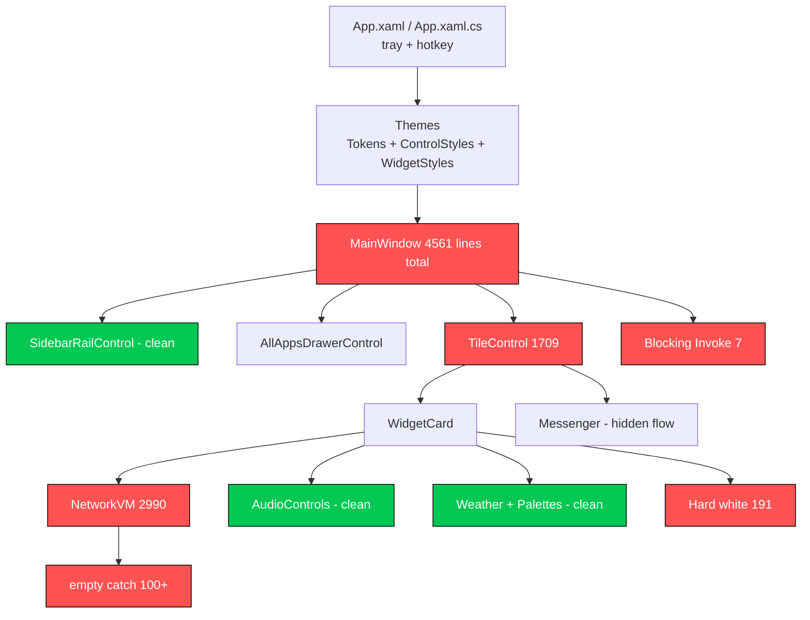
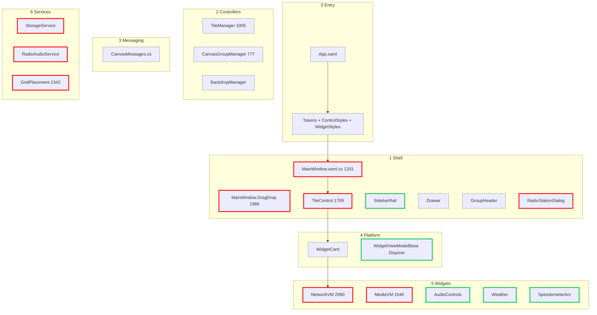

# MetroHub UI System Map — How Everything Connects

For contributors + noobs. Top to bottom = click to pixel.
Red = problem file. Green = good example to copy.

## Overview

## Layer Map

## How Flow Works

1. `App` loads `Tokens.xaml` then `MainWindow`.
2. `MainWindow` -> `Controllers` move/resize, `Sidebar` pins, `Drawer` searches.
3. `TileControl` hosts `WidgetCard`, card hosts widget view.
4. Widget talks to `Core Service`, service talks to Windows OS, result back via `InvokeAsync`.
5. `CanvasMessages` + `WeakReferenceMessenger` replace `MainWindow.Current` in widgets.
6. Close/unpin -> `Teardown()` -> `Dispose()` stops timers + `-=` events.

## Red List — Fix First

- `White 191`: `Foreground="#"` -> `{DynamicResource TextPrimaryBrush}`. Files: Network 46, RadioDialog 17, TileControl 13.
- `Catch 100+`: `catch {}` with no log in `StorageService`, `RadioAudioService`, `App.xaml.cs`. Add log line.
- `Invoke 7`: `Dispatcher.Invoke` in `MainWindow 653`, `RadioDialog 375`, `App 138`. Change to `InvokeAsync`.
- `Gods`: `Network 2990`, `Drag 1986`, `Grid 2342`, `Tile 1709`, `Media 1540`. Split by panel.
- `C# colors 45`: move chrome red/green/blue to `ThemeTokens.cs`, keep Weather/Dino/Pomodoro palettes local frozen.

## Green Copy

- `SpeedometerArcControl.cs`: static frozen pens once, visibility pause, DPI cache.
- `WeatherPalettes.cs`: frozen AQI/UV dict.
- `AudioControlsWidgetView.xaml`: header/body/caption tokens + `IsCompactMode` collapse.

## Add Widget in 5 Steps

1. Copy `Widgets/Catalog/Media` to `Widgets/Catalog/MyWidget` (View.xaml + ViewModel + Model).
2. Use `WidgetMicroButtonStyle`, `WidgetFloatingScrollViewerStyle`, `BoolToVis`, `WidgetHairlineDividerStyle`.
3. Text only `TypeCaption 12`, `TypeBody 14`, `TypeHeader 16`, `TypeDisplay 28`.
4. No `MainWindow.Current`. Use messenger. Dialogs set `IsDialogOpen=true`.
5. Add STA test `new MyWidgetView()` + run `dotnet build`, `dotnet test`.

## Why Red Is Problem - Simple Words

1. White 191 - Problem: same white written 191 times. If you change theme, 191 places stay old white, app looks half-white half-grey. Affects: Settings theme + dark mode + all text. Fix result: change 1 line, full app changes. No look change today.

2. Empty catch 100+ - Problem: when bug comes you hide it, no message. You will never find why WiFi list empty or icon missing. Affects: WiFi, apps list, radio, storage save. Fix result: one log line each, bugs show in logs, easy to fix. No look change.

3. Blocking Invoke 7 - Problem: background thread stops and waits for UI. If UI busy resizing tile, search freezes 1-2 sec. Affects: radio search, weblink favicon, tray open, hotkey. Fix result: use InvokeAsync, search keeps running, UI smooth. No look change.

4. Gods Network 2990 / Drag 1986 / Grid 2342 / Tile 1709 - Problem: new boy opens 3000 lines, gets scared, makes mistake in wrong place, breaks WiFi + speed + usage together. Affects: Network speed test, drag-drop, layout save. Fix result: small files per panel, safe to edit one without breaking other. No look change, less crash.

5. C# colors 45 - Problem: same red/green/blue made new every click. Memory fills, GC stops app = stutter. Accent setting misses these. Affects: drag red border, toast icon, toggle green, slider blue. Fix result: one frozen brush reused, faster + accent works everywhere.

6. Messenger hidden flow - Problem: Tile sends message, MainWindow handles far away. New dev cannot find who runs on click. Affects: pin, resize, group, unpin. Fix result: keep message map table updated in CanvasMessages.cs, debug in 1 min not 1 hour.
