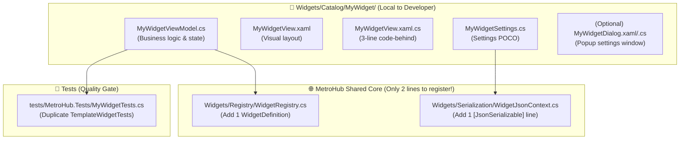

# 🧩 MetroHub Widget Architecture & Developer Journey Audit

**Audit Date**: October 2, 2026  
**Scope**: All 18 Catalog Widgets, UI Styling Pipeline, Core OS Services, Lifecycle & Persistence  
**Target Audience**: Repository Maintainer & Future 3rd-Party Widget Developers  

---

## Executive Summary

> [!IMPORTANT]
> **Verdict on the "Labyrinth"**: **The labyrinth does NOT exist for widget development.**
> To build a fully functional, production-ready widget with settings, background polling, and custom UI, a new developer touches **4 files inside their own folder** and **exactly 2 files outside** for registration. They do **NOT** have to dig through 10+ different files or hunt through CSS/XAML mazes.

### Developer Experience Scorecard

| Area | Score | Status | Notes |
| :--- | :---: | :---: | :--- |
| **Folder Isolation** | **A+** | 🟢 Optimal | Every widget lives in its own self-contained directory under `Widgets/Catalog/<Name>/`. |
| **Plumbing & Wiring** | **A** | 🟢 Minimal | Only 2 lines of external code needed: `WidgetRegistry.cs` and `WidgetJsonContext.cs`. |
| **UI Control Standard** | **A** | 🟢 Unified | WinUI 3 buttons, toggles, sliders, and tokens are globally accessible without local boilerplate. |
| **Background Lifecycle** | **A+** | 🟢 Zero-Leak | `OnSecondTick` hook automatically handles 1s ticks and sleep/resume without manual timers. |
| **Settings & Persistence** | **A-** | 🟢 Solid | Compile-time AOT JSON serialization; requires 1 attribute registration in `WidgetJsonContext`. |
| **Network & HTTP API** | **B+** | 🟡 Needs Helper | Works via standard `HttpClient`, but lacks a single centralized `HttpHelper` utility. |
| **Windows & Hardware API** | **A-** | 🟢 Encapsulated | Native Win32/COM/PInvoke calls are cleanly isolated in `Core/Services/`, never in ViewModels. |

---

## 1. The Anatomy of a Widget: What Files Must a Developer Touch?

### The Exact File Checklist:

1. **`MyWidgetViewModel.cs`** *(Local)*: Inherits `WidgetViewModelBase`. Houses properties, commands, and `OnSecondTick`.
2. **`MyWidgetView.xaml`** *(Local)*: Wraps UI in `<widgets:WidgetCard>`.
3. **`MyWidgetView.xaml.cs`** *(Local)*: Boilerplate `InitializeComponent();`.
4. **`MyWidgetSettings.cs`** *(Local)*: Plain C# class holding user preferences.
5. **`WidgetRegistry.cs`** *(External Line 1)*: Registers ID, title, category, and factory.
6. **`WidgetJsonContext.cs`** *(External Line 2)*: Registers settings class for trimming-safe JSON.
7. **`MyWidgetTests.cs`** *(External Test)*: Validates settings serialization and state transitions.

**Total developer touchpoints: 4 local files + 2 centralized registrations.**

---

## 2. The 30+ Common Developer Scenarios Matrix

When a developer asks *"Where do I look to do X?"*, here is the exact architectural routing:

### A. UI & Visual Controls (Zero imports needed — all globally available)

| # | What Developer Wants | What They Write in XAML | Source File Behind It |
| :-: | :--- | :--- | :--- |
| **1** | Primary Accent Button | `<Button Style="{DynamicResource AccentButtonStyle}" Content="Save" />` | `ControlStyles.xaml` |
| **2** | Secondary / Neutral Button | `<Button Style="{DynamicResource DefaultButtonStyle}" Content="Cancel" />` | `ControlStyles.xaml` |
| **3** | Borderless Icon / Ghost Button | `<Button Style="{DynamicResource SubtleButtonStyle}"> <ui:SymbolIcon Symbol="Dismiss24"/> </Button>` | `ControlStyles.xaml` |
| **4** | Compact 28×28 Icon Button | `<Button Style="{StaticResource WidgetMicroButtonStyle}" ... />` | `WidgetStyles.xaml` |
| **5** | Medium 32×28 Transport Button | `<Button Style="{StaticResource WidgetMediumButtonStyle}" ... />` | `WidgetStyles.xaml` |
| **6** | Stepper / Nav Button | `<Button Style="{StaticResource WidgetNavButtonStyle}" ... />` | `WidgetStyles.xaml` |
| **7** | Animated Toggle Switch | `<ui:ToggleSwitch IsChecked="{Binding IsActive}" />` | `ControlStyles.xaml` |
| **8** | Amber / Warning Toggle Switch | `<ui:ToggleSwitch Style="{StaticResource FluentAmberToggleSwitchStyle}" />` | `ControlStyles.xaml` |
| **9** | Red / Danger Toggle Switch | `<ui:ToggleSwitch Style="{StaticResource FluentRedToggleSwitchStyle}" />` | `ControlStyles.xaml` |
| **10** | Standard Slider | `<Slider Minimum="0" Maximum="100" Value="{Binding Level}" />` | Built-in WPF |
| **11** | Colored Fill Volume Slider | `<controls:WidgetVolumeSlider Value="{Binding Vol}" ... />` | `Controls/WidgetVolumeSlider.xaml` |
| **12** | Glass Text Input Box | `<TextBox Style="{DynamicResource FluentGlassInputStyle}" />` | `ControlStyles.xaml` |
| **13** | Search Box with Search Icon | `<TextBox Style="{DynamicResource FluentGlassSearchInputStyle}" />` | `ControlStyles.xaml` |
| **14** | URL Box with Paste Button | `<TextBox Style="{DynamicResource FluentGlassUrlWithPasteInputStyle}" />` | `ControlStyles.xaml` |
| **15** | Segmented Toggle / Tab Strip | `<widgets:WidgetSegmentedControl>` + `<widgets:WidgetSegmentedItem>` | `WidgetStyles.xaml` |
| **16** | Header Action Tiles Strip | `<widgets:WidgetTiles>` + `<widgets:WidgetTile>` | `WidgetStyles.xaml` |
| **17** | Hairline Horizontal Divider | `<Border Style="{StaticResource WidgetHairlineDividerStyle}" />` | `WidgetStyles.xaml` |
| **18** | Hairline Vertical Divider | `<Border Style="{StaticResource WidgetVerticalHairlineDividerStyle}" />` | `WidgetStyles.xaml` |
| **19** | 7px Round Status / Cycle Dot | `<Border Style="{StaticResource WidgetIndicatorDotStyle}" />` | `WidgetStyles.xaml` |
| **20** | Fluent Vector Icon | `<ui:SymbolIcon Symbol="Heart24" FontSize="16" />` (4,000+ icons) | `WPF-UI` library |
| **21** | Modal Settings Window | `<dialogs:MetroDialog Title="..." Subtitle="...">` | `Presentation/Dialogs/MetroDialog.xaml` |
| **22** | Primary Text Color | `Foreground="{DynamicResource TextPrimaryBrush}"` | `Tokens.xaml` |
| **23** | Secondary / Muted Text | `Foreground="{DynamicResource TextSecondaryBrush}"` | `Tokens.xaml` |
| **24** | Accent Highlight Color | `Foreground="{DynamicResource SystemAccentColorPrimaryBrush}"` | `Tokens.xaml` |
| **25** | Header Font Size | `FontSize="{DynamicResource TypeHeaderFontSize}"` (16px SemiBold) | `Tokens.xaml` |
| **26** | Body Font Size | `FontSize="{DynamicResource TypeBodyFontSize}"` (14px Regular) | `Tokens.xaml` |
| **27** | Caption Font Size | `FontSize="{DynamicResource TypeCaptionFontSize}"` (12px Regular) | `Tokens.xaml` |
| **28** | Big Display Digit Font Size | `FontSize="{DynamicResource TypeDisplayFontSize}"` (28px SemiBold) | `Tokens.xaml` |
| **29** | Giant Hero Clock Font Size | `FontSize="{DynamicResource TypeHeroFontSize}"` (72px Bold) | `Tokens.xaml` |

---

### B. Logic, Timers, Lifecycle & Persistence

| # | What Developer Wants | How They Implement It | Underlying Service |
| :-: | :--- | :--- | :--- |
| **30** | 1-Second Timer / Clock Tick | Override `public override void OnSecondTick(DateTime utcNow)` | `WidgetHeartbeatService` (Auto-managed) |
| **31** | Pause Work When Hub Hides | Override `public override void Pause()` | `WidgetViewModelBase` (Auto-cascaded) |
| **32** | Resume Work When Hub Shows | Override `public override void Resume()` | `WidgetViewModelBase` (Auto-cascaded) |
| **33** | Save Widget Settings | Call `SaveSettings();` & `NotifySettingsChanged();` | `WidgetStateStore` + `WidgetMessenger` |
| **34** | Load Widget Settings | Override `protected override void LoadSettings(string? json)` | `WidgetSerializer` (AOT System.Text.Json) |
| **35** | Clean Up Resources on Delete | Override `protected override void Dispose(bool disposing)` | `WidgetViewModelBase.Dispose` |
| **36** | Send Message to Another Widget | `WidgetMessenger.Default.Send(new MyCustomMessage(...))` | CommunityToolkit Messenger |
| **37** | Listen to Hub Visibility | Handled automatically; or implement `IRecipient<T>` | `WidgetMessenger.Default` |

---

### C. OS, Hardware & Network Calls

| # | What Developer Wants | Recommended Architectural Route | Existing Core Implementation |
| :-: | :--- | :--- | :--- |
| **38** | Make HTTP REST API Call | Use `HttpClient` with cancellation token in async command | `WeatherService.cs` (`SocketsHttpHandler`) |
| **39** | Read/Write Cache or App Files | Use `AppPaths.CacheDirectory` or `AppPaths.AppDataDirectory` | `Core/Services/AppPaths.cs` |
| **40** | Master System Volume & Mute | Call `AudioService.Instance.SetMasterVolume(val)` | `Core/Audio/AudioService.cs` (CoreAudio) |
| **41** | Per-App Volume & Audio Sessions | Query `AudioService.Instance.Sessions` | `Core/Audio/AudioService.cs` (WASAPI) |
| **42** | Monitor Brightness (Laptop/DDC) | Call `MonitorBrightnessService.Instance.SetBrightness(id, val)` | `Core/Display/MonitorBrightnessService.cs` (DXVA2) |
| **43** | Prevent Windows Sleep (Caffeine) | Call `PowerAwakeService.Instance.SetMode(AwakeMode.Indefinite)` | `Core/Power/PowerAwakeService.cs` (Win32) |
| **44** | Display Warmth / Night Light | Call `NightLightService.Instance.SetStrength(val)` | `Core/Display/NightLightService.cs` (GDI Gamma) |
| **45** | Wi-Fi Signal & SSID | Query `NativeWifiService.Instance` | `Core/Network/NativeWifiService.cs` (WlanApi) |
| **46** | Network Download/Upload Speed | Query `ThroughputService.Instance` | `Core/Network/ThroughputService.cs` (IpHelper) |
| **47** | System Media Playing (Spotify/YT) | Bind to `WindowsMediaController.MediaManager` | `ManagedMediaManager` (Windows SMTC) |
| **48** | Online Radio / Audio Streaming | Call `RadioAudioService.Instance.PlayStream(url)` | `Core/Radio/RadioAudioService.cs` (ManagedBass) |
| **49** | Audio Sound Effects (Clicks/Beeps)| Call `DinoAudioService` or `RoverAudioService` | `ManagedBass` Sound Effects |
| **50** | Launch External App or URL | Call `ProcessLauncherService.Launch(path)` | `Core/Services/ProcessLauncherService.cs` |

---

## 3. Architectural Strengths: Why the System Holds Up

1. **Zero Raw P/Invoke Inside Widgets**:
   No widget ViewModel directly calls `[DllImport]`. Hardware access (volume, gamma, sleep, brightness, Wi-Fi) is strictly encapsulated in singleton services inside `Core/`. A new widget developer who wants to adjust brightness or audio never writes C++ or Win32 COM interfaces—they just call `AudioService.Instance` or `MonitorBrightnessService.Instance`.

2. **Automated Lifecycle & Zero Idle CPU**:
   Widgets do not instantiate `DispatcherTimer`. The hub has a single central `WidgetHeartbeatService` that pulses once per second only while MetroHub is visible. When MetroHub minimizes to tray, the pulse halts, pausing all 18 widgets simultaneously. This prevents battery drain on laptops.

3. **Weak-Reference Messaging**:
   Widgets communicate with the hub canvas and dialogs via `WidgetMessenger.Default` (CommunityToolkit.Mvvm). When a widget is unpinned or closed, it unregisters cleanly without dangling event handlers or memory leaks.

4. **Self-Documenting Developer Boilerplate**:
   The `src/MetroHub/Widgets/Catalog/Template/` directory contains an exact, working boilerplate. A developer duplicates the folder, renames the prefix, and they immediately have a working widget with tests.

---

## 4. Identified Friction Points & Gaps (Honest Assessment)

While the architecture is well-structured, the audit revealed **three concrete friction points** for third-party developers:

### ⚠️ Friction Point 1: No Centralized HTTP Helper
* **Current State**: `WeatherService` and `RadioBrowserClient` each create their own `HttpClient` instances with custom handlers.
* **Problem for New Devs**: A new developer building a Crypto, Stock, or RSS widget might write `new HttpClient()` inside a loop, causing TCP socket exhaustion on Windows.
* **Fix**: Provide a lightweight `HttpService` in `Core/Services/` that provides pre-configured HTTP GET/POST methods with timeout and retry defaults.

### ⚠️ Friction Point 2: Core Services Are Undocumented for Widget Authors
* **Current State**: Services like `AudioService`, `PowerAwakeService`, `MonitorBrightnessService`, and `ProcessLauncherService` exist, but a new developer wouldn't know they exist unless they grep the `Core/` directory.
* **Fix**: Add a **"System Services Directory"** section to [`src/MetroHub/Widgets/Catalog/Template/README.md`](file:///d:/MetroHub/src/MetroHub/Widgets/Catalog/Template/README.md) listing the available singleton services and what they do.

### ⚠️ Friction Point 3: Dual Registration (`WidgetRegistry` + `WidgetJsonContext`)
* **Current State**: Developers must remember to add their settings class to `WidgetJsonContext.cs` as `[JsonSerializable(typeof(MySettings))]`. If they forget, settings fail to deserialize at runtime.
* **Fix**: The automated test `WidgetLifecycleContractTests` catches this, but a clear note in the developer guide prevents the initial confusion.

---

## 5. Conclusion

**The architecture is clean, decoupled, and standard.**  
The fear that new developers would face a "labyrinth" or "vomit" is unfounded:
* They touch only **2 external files** to register a widget.
* All controls, buttons, toggles, and colors are globally available through standard WinUI naming conventions.
* No raw Windows API code is required for standard widget features.
* The test suite provides an automated safety net that validates every registered widget against memory leaks, pause/resume contracts, and serialization errors.
